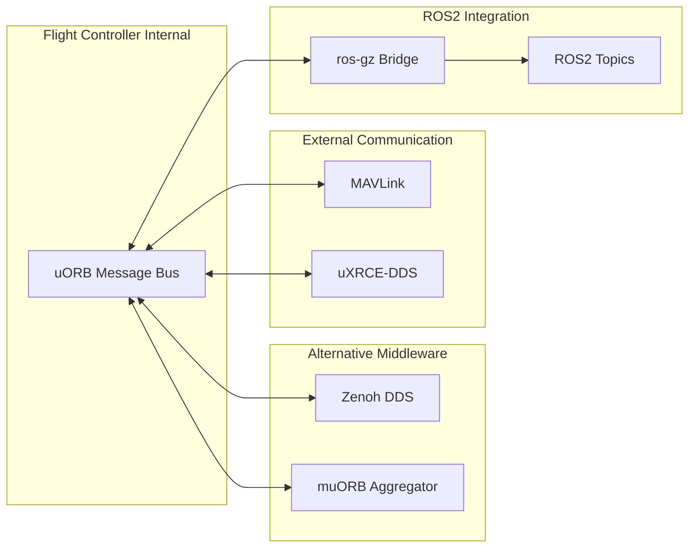

# Communication Stack

VisionFlow-PX4 supports multiple communication protocols and middleware, enabling data exchange between the flight controller, simulation, ground station, and ROS2.

## Communication Protocol Overview



## uORB Message Bus

uORB (micro Object Request Broker) is PX4's internal message bus, using a publish-subscribe pattern.

### Message Count

- Approximately 180+ `.msg` files in total
- Includes standard PX4 messages and custom messages

### Custom Messages

| Message | Purpose | Publisher |
|------|------|--------|
| `ArmJointState.msg` | Arm joint state | gamma_arm_dynamics |
| `CollisionConstraints.msg` | Collision avoidance constraints | pregme_pos_control |
| `TrajectorySetpoint6dof.msg` | 6-DOF trajectory setpoint | position controller |
| `Rover*` series | Rover-specific control messages | rover_differential |

## Zenoh Middleware

Zenoh is a lightweight alternative to DDS, suitable for resource-constrained environments.

### Features

- Low overhead, suitable for embedded deployment
- Supports both publish-subscribe and request-reply modes
- Interoperable with standard DDS

### Configuration

The Zenoh module is located at `src/modules/zenoh/` and communicates with the flight control core via uORB messages.

## uXRCE-DDS Client

uXRCE-DDS implements DDS communication over serial links (UART/CAN/USB).

### Use Cases

- Bridge PX4 data to remote ROS2 nodes
- Support real-time control in low-bandwidth environments
- Communication channel for hardware-in-the-loop simulation

### Module

Located at `src/modules/uxrce_dds_client/`, communicates with tools like MAVROS via UDP ports 14540/14557.

## MAVLink

MAVLink is the de facto standard communication protocol in the UAV domain.

### Connection Configuration

| Direction | Address | Purpose |
|------|------|------|
| SITL -> GCS | `udp://:14540@localhost:14557` | Send to QGroundControl |
| MAVROS | `udp://:14540@localhost:14557` | ROS2 to flight controller communication |

### MAVROS Launch

```bash
source thirdparty/install/setup.bash && \
  ros2 launch mavros px4.launch fcu_url:=udp://:14540@localhost:14557
```

## ros-gz Bridge

The ros-gz Bridge provides data bridging between Gazebo and ROS2.

### Launch Commands

```bash
# Data bridging
bash windshape_dev/data_stream/gz_bridge/bridge_gz_ros.sh

# Camera stream
bash windshape_dev/data_stream/image_stream/camera_stream.sh
```

### Bridged Topic Examples

| Gazebo Topic | ROS2 Topic | Description |
|-------------|-----------|------|
| `/camera/image_raw` | `/camera/image_raw` | Camera image |
| `/imu` | `/imu` | Inertial measurement unit |
| `/gps/fix` | `/gps/fix` | GPS positioning |
| `/joint_states` | `/joint_states` | Joint state |
