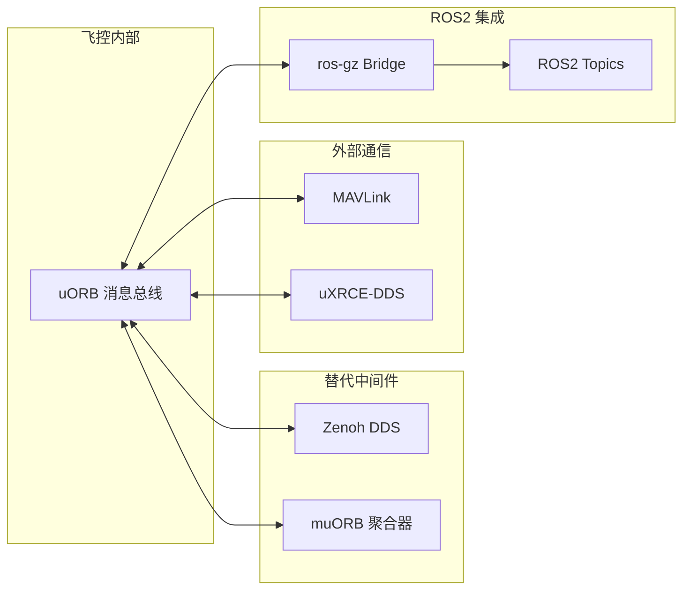

# 通信栈

VisionFlow-PX4 支持多种通信协议和中间件，实现飞控、仿真、地面站和 ROS2 之间的数据交换。

## 通信协议总览



## uORB 消息总线

uORB（micro Object Request Broker）是 PX4 的内部消息总线，采用发布-订阅模式。

### 消息数量

- 总计约 180+ `.msg` 文件
- 包括标准 PX4 消息和自定义消息

### 自定义消息

| 消息 | 用途 | 发布者 |
|------|------|--------|
| `ArmJointState.msg` | 机械臂关节状态 | gamma_arm_dynamics |
| `CollisionConstraints.msg` | 碰撞避免约束 | pregme_pos_control |
| `NeuralControl.msg` | 神经网络控制调试 | mc_nn_control |
| `TrajectorySetpoint6dof.msg` | 6-DOF 轨迹设定值 | 位置控制器 |
| `Rover*` 系列 | 小车专用控制消息 | rover_differential |

## Zenoh 中间件

Zenoh 是 DDS 的轻量级替代方案，适用于资源受限的环境。

### 特点

- 低开销，适合嵌入式部署
- 支持 publish-subscribe 和 request-reply 两种模式
- 可与标准 DDS 互操作

### 配置

Zenoh 模块位于 `src/modules/zenoh/`，通过 uORB 消息与飞控核心通信。

## uXRCE-DDS 客户端

uXRCE-DDS 通过串行链路（UART/CAN/USB）实现 DDS 通信。

### 用途

- 将 PX4 数据桥接到远程 ROS2 节点
- 支持低带宽环境下的实时控制
- 硬件在环仿真的通信通道

### 模块

位于 `src/modules/uxrce_dds_client/`，通过 UDP 端口 14540/14557 与 MAVROS 等工具通信。

## MAVLink

MAVLink 是无人机领域的事实标准通信协议。

### 连接配置

| 方向 | 地址 | 用途 |
|------|------|------|
| SITL → GCS | `udp://:14540@localhost:14557` | 发送到 QGroundControl |
| MAVROS | `udp://:14540@localhost:14557` | ROS2 与飞控通信 |

### MAVROS 启动

```bash
source thirdparty/install/setup.bash && \
  ros2 launch mavros px4.launch fcu_url:=udp://:14540@localhost:14557
```

## ros-gz Bridge

ros-gz Bridge 实现 Gazebo 与 ROS2 之间的数据桥接。

### 启动方式

```bash
# 数据桥接
bash windshape_dev/data_stream/gz_bridge/bridge_gz_ros.sh

# 摄像头流
bash windshape_dev/data_stream/image_stream/camera_stream.sh
```

### 桥接话题示例

| Gazebo Topic | ROS2 Topic | 说明 |
|-------------|-----------|------|
| `/camera/image_raw` | `/camera/image_raw` | 摄像头图像 |
| `/imu` | `/imu` | 惯性测量单元 |
| `/gps/fix` | `/gps/fix` | GPS 定位 |
| `/joint_states` | `/joint_states` | 关节状态 |
