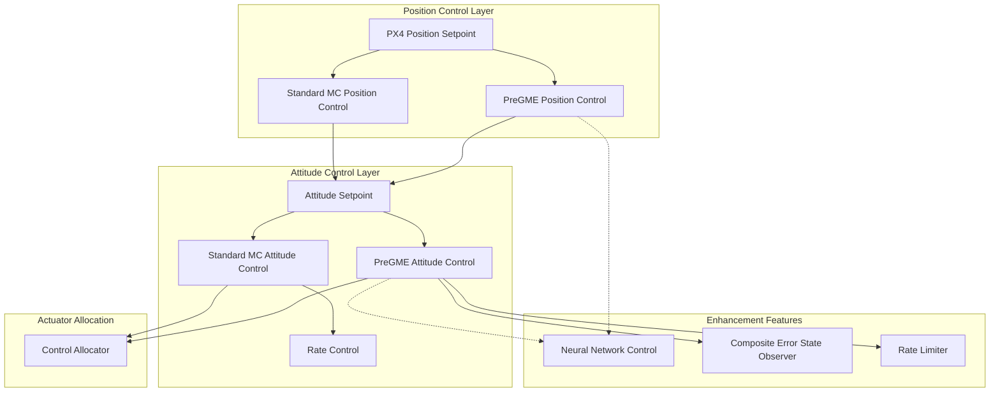

# Control Stack

The control stack is the core of VisionFlow-PX4, responsible for converting state estimation into actuator commands.

## Controller Architecture



## PreGME Controllers

PreGME (Prescribed Performance Guidance and Management Estimator) is the primary research contribution of this project.

### Prescribed Performance Control (PPC)

PPC maps constrained errors to an unconstrained space through transformation functions, ensuring that system responses always remain within prescribed performance bounds:

- **Convergence Rate** — Controls the error convergence rate through prescribed functions
- **Overshoot** — Strictly limits maximum overshoot
- **Steady-State Accuracy** — Guarantees final error is less than a predetermined threshold

### Composite Error State Observer (CESO)

CESO estimates and compensates for system uncertainties and external disturbances:

| Estimate | Description |
|--------|------|
| Inertia Matrix | Online estimation of aircraft inertia parameter variations |
| Disturbance Observation | Estimates wind disturbances, arm reaction forces, etc. |
| Trajectory Prescription | Supports multiple prescribed trajectory modes |

### Parameter Files

- English parameter reference: `src/modules/pregme_att_control/pregme_att_control_params_en.yaml`
- Chinese parameter reference: `src/modules/pregme_att_control/pregme_att_control_params_zh.yaml`

## Standard Controllers

Standard PX4 controllers (MPC) are retained for comparative testing and fallback operation:

| Module | Description |
|------|------|
| `mc_att_control` | Multicopter attitude control (MPC) |
| `mc_pos_control` | Multicopter position control (MPC) |
| `mc_rate_control` | Multicopter rate control |
| `mc_autotune_attitude_control` | Autotune attitude control |

## Switching Mechanism

The active controller is selected via the airframe configuration file:

```bash
# Use PreGME controllers (default)
4004_gz_q940_ti_gripper3  # Uses pregme_att_control + pregme_pos_control

# Use standard controllers
4001_gz_x500              # Uses mc_att_control + mc_pos_control
```
