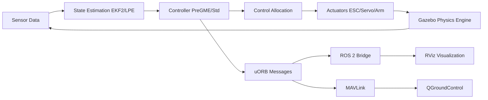

# Architecture Overview

This section provides a high-level overview of the system architecture. For detailed information on each subsystem, refer to the following chapters:

- [Control Stack](control-stack.md) — Flight control algorithms and data flow
- [Simulation Stack](simulation-stack.md) — Gazebo simulation and plugin architecture
- [Communication Stack](communication-stack.md) — uORB, MAVLink, DDS middleware

## System Components

VisionFlow-PX4 consists of the following major subsystems:

| Subsystem | Directory | Description |
|--------|------|------|
| Flight Control Core | `src/modules/` | 47 PX4 modules |
| Custom Controllers | `src/modules/pregme_*` | PreGME prescribed performance control |
| Arm Dynamics | `src/lib/gamma_arm_dynamics/` | Gamma series arm models |
| Simulation Assets | `Tools/simulation/gz/` | Gazebo worlds and models |
| Toolchain | `windshape_dev/` | Control GUI, log review, data streaming |
| Docker Environment | `docker/` | Containerized workflow |
| Board Support | `boards/` | Hardware configurations for 10 vendors |
| Communication Messages | `msg/` | 180+ uORB message definitions |

## Data Flow

