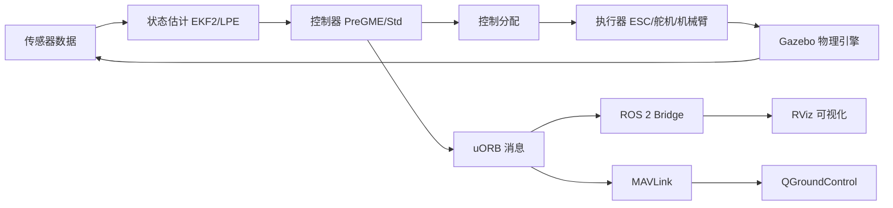

# 架构总览

本节提供系统架构的高层次概述。如需深入了解各个子系统，请参考以下章节：

- [控制栈](control-stack.md) — 飞行控制算法和数据流
- [仿真栈](simulation-stack.md) — Gazebo 仿真和插件架构
- [通信栈](communication-stack.md) — uORB、MAVLink、DDS 中间件

## 系统组成

VisionFlow-PX4 由以下主要子系统组成：

| 子系统 | 目录 | 说明 |
|--------|------|------|
| 飞控核心 | `src/modules/` | 47 个 PX4 模块 |
| 自定义控制器 | `src/modules/pregme_*` | PreGME 预设性能控制 |
| 机械臂动力学 | `src/lib/gamma_arm_dynamics/` | Gamma 系列机械臂模型 |
| 仿真资产 | `Tools/simulation/gz/` | Gazebo 世界和模型 |
| 工具链 | `windshape_dev/` | 控制 GUI、日志审查、数据流 |
| Docker 环境 | `docker/` | 容器化工作流 |
| 板级支持 | `boards/` | 10 个厂商的硬件配置 |
| 通信消息 | `msg/` | 180+ uORB 消息定义 |

## 数据流

