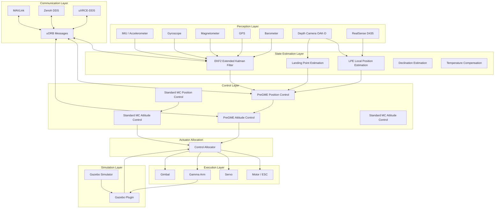

# System Architecture Overview

VisionFlow-PX4 is a customized fork based on PX4 Autopilot V1.17.0, designed specifically for UAV-arm collaborative operation simulation.

## Overall Architecture

## Key Design Decisions

### Dual Controller Coexistence

Standard PX4 controllers (`mc_att_control` / `mc_pos_control`) and PreGME controllers (`pregme_att_control` / `pregme_pos_control`) coexist simultaneously. The active controller is selected via the airframe configuration.

### Modular Architecture

Each control function is implemented as an independent PX4 module, communicating via uORB messages. This design enables:
- New controllers to be developed in parallel without affecting existing functionality
- Sensor simulators to operate independently from control logic
- Arm integration to be implemented through independent Gazebo plugins

### Multi-Level Simulation Support

| Simulation Level | Description | Use Case |
|---------|------|---------|
| SITL | Software-in-the-loop, PX4 runs on host | Controller development, parameter tuning |
| Gazebo | Full physics simulation | System integration testing |
| HITL | Hardware-in-the-loop, real flight controller connected | Firmware verification, hardware testing |
| SIH | Simulation-in-hardware | Algorithm prototype validation |

## Differences from Standard PX4

1. **PreGME Controllers** — Sliding-mode PPC replacing standard MPC
2. **Gamma Arm Integration** — `gamma_arm_dynamics` bridges flight controller and arm
3. **Enhanced Simulation Stack** — Custom worlds, models, plugins
4. **Native ROS2 Integration** — Zenoh, uXRCE-DDS, Gazebo-ROS Bridge
5. **Camera Feedback Pipeline** — OAK-D and Intel RealSense with geotagging
