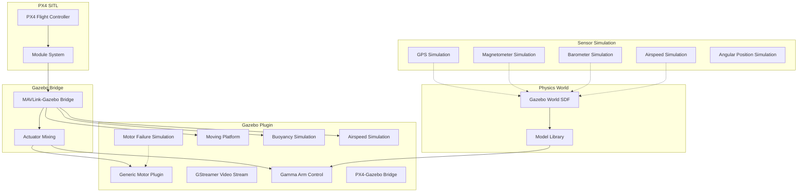

# Simulation Stack

The simulation stack is responsible for simulating the physical behavior of the aircraft, arm, and environment in Gazebo.

## Simulation Architecture



## Gazebo Plugins

### Core Plugins

| Plugin | Path | Function |
|------|------|------|
| GammaArmControl | `windshape_dev/plugins/gamma_arm_control/` | Arm joint control |
| PX4GzSimBridge | `windshape_dev/plugins/px4_gzsim_bridge/` | MAVLink-Gazebo bridge |
| JointPositionController | `windshape_dev/plugins/joint_position_controller/` | Joint position control |

### Simulation Plugins

| Plugin | Description |
|------|------|
| `generic_motor` | Generic motor model, supports ESC simulation |
| `gstreamer` | Real-time video stream output |
| `motor_failure` | Motor failure injection for fault-tolerant control testing |
| `moving_platform` | Moving platform simulation |
| `buoyancy` | Hydrodynamic buoyancy simulation |
| `airspeed` | Airspeed sensor simulation |

## Sensor Simulation

| Sensor | Module | Description |
|--------|------|------|
| GPS | `sensor_gps_sim` | Simulates GPS positioning, supports multi-constellation |
| Magnetometer | `sensor_mag_sim` | Simulates geomagnetic field, supports interference |
| Barometer | `sensor_baro_sim` | Simulates altitude measurement |
| Airspeed | `sensor_airspeed_sim` | Simulates pitot-tube airspeed |
| AGP | `sensor_agpsim` | Simulates angular position sensor |

## Lockstep Scheduler

To ensure precise temporal synchronization in simulation, all simulation configurations enable the lockstep scheduler:

```bash
EXTRA_CMAKE_ARGS="-DENABLE_LOCKSTEP_SCHEDULER=ON"
```

The lockstep scheduler ensures:
- PX4 control loops are strictly aligned with Gazebo simulation steps
- Sensor data is published at the correct simulation time
- Actuator commands are applied to the physics engine at the correct time
