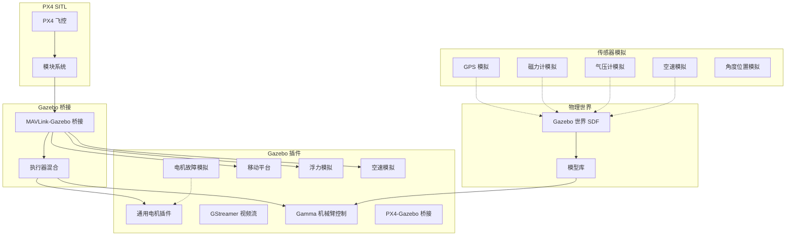

# 仿真栈

仿真栈负责在 Gazebo 中模拟飞行器、机械臂和环境的物理行为。

## 仿真架构



## Gazebo 插件

### 核心插件

| 插件 | 路径 | 功能 |
|------|------|------|
| GammaArmControl | `windshape_dev/plugins/gamma_arm_control/` | 机械臂关节控制 |
| PX4GzSimBridge | `windshape_dev/plugins/px4_gzsim_bridge/` | MAVLink-Gazebo 桥接 |
| JointPositionController | `windshape_dev/plugins/joint_position_controller/` | 关节位置控制 |

### 仿真插件

| 插件 | 说明 |
|------|------|
| `generic_motor` | 通用电机模型，支持 ESC 模拟 |
| `gstreamer` | 实时视频流输出 |
| `motor_failure` | 电机故障注入，用于容错控制测试 |
| `moving_platform` | 移动平台模拟 |
| `buoyancy` | 水动力浮力模拟 |
| `airspeed` | 空速传感器模拟 |

## 传感器模拟

| 传感器 | 模块 | 说明 |
|--------|------|------|
| GPS | `sensor_gps_sim` | 模拟 GPS 定位，支持多星座 |
| 磁力计 | `sensor_mag_sim` | 模拟地磁场，支持干扰 |
| 气压计 | `sensor_baro_sim` | 模拟高度测量 |
| 空速 | `sensor_airspeed_sim` | 模拟皮托管空速 |
| AGP | `sensor_agpsim` | 模拟角度位置传感器 |

## 锁步调度器

为确保仿真时序精确同步，所有仿真配置都启用了锁步调度器：

```bash
EXTRA_CMAKE_ARGS="-DENABLE_LOCKSTEP_SCHEDULER=ON"
```

锁步调度器确保：
- PX4 控制循环与 Gazebo 仿真步长严格对齐
- 传感器数据在正确的仿真时刻发布
- 执行器命令在正确的时刻应用到物理引擎
