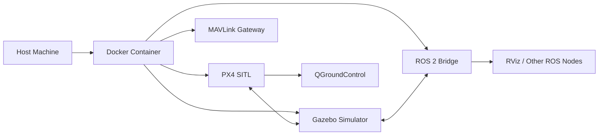

# Docker Launch Guide

The Docker method encapsulates a complete ROS2 Humble + Gazebo environment and is the recommended launch method.

## How It Works



## Quick Launch

### List Available Configurations

```bash
bash docker/run_gz_sitl.sh --list
```

### Launch Default Configuration (Entity 1)

```bash
bash docker/run_gz_sitl.sh --profile "Entity 1"
```

### Launch Specified Configuration

```bash
bash docker/run_gz_sitl.sh --profile "Entity 4"
```

### Rebuild Image and Launch

```bash
bash docker/run_gz_sitl.sh --build --profile "Entity 1"
```

## Available Simulation Configurations

| Profile | Description | Drone Model | Scene |
|---------|------|-----------|------|
| Entity 1 | PreGME Jimengyu model | q940_ti_gripper4 | laboratory_landingbox |
| Entity 2 | PreGME VLA task | q940_ti_gripper4 | laboratory_landingbox_vla_task0 |
| Entity 3 | PreGME company legacy version | swan_gamma_v1 | laboratory_no_landingbox |
| Entity 4 | PreGME company new version | swan_gamma_v2 | laboratory_no_landingbox |
| Entity 5 | PreGME VLA task | swan_gamma_v2 | laboratory_no_landingbox_vla_task0 |
| Entity 6 | X500 Gimbal | x500_gimbal | laboratory_no_landingbox |
| Entity 7 | Differential Rover | differential_rover | laboratory_no_landingbox |

## Enter Running Container

```bash
bash docker/into_gz_sitl.sh
```

After entering the container, you can:
- Run ROS 2 nodes
- Debug Gazebo plugins
- Modify parameters and restart simulation

## Docker Architecture Details

### Key compose.yaml Configuration

```yaml
services:
  px4-humble-gz:
    build:
      context: ..
      dockerfile: docker/Dockerfile.humble-gz
    deploy:
      resources:
        reservations:
          devices:
            - driver: nvidia
              capabilities: [gpu]
    volumes:
      - ..:/workspace:rw
      - ccache:/home/px4/.ccache
      - gz_cache:/home/px4/.gz
    shm_size: '2gb'
    privileged: true
    network_mode: host
```

### Mount Volume Description

| Mount Path | Type | Purpose |
|---------|------|------|
| `/workspace` (mapped from `..`) | Read-write (bidirectional) | Full codebase access |
| `ccache` | Named volume | Compiler cache to speed up builds |
| `gz_cache` | Named volume | Gazebo resource cache |
| `/dev/dri` | Device | GPU passthrough |
| `/tmp/.X11-unix` | Socket | X11 display |

## Troubleshooting

### Slow Build

Use ccache to speed up subsequent builds:

```bash
# Clear cache and rebuild
docker volume rm visionflow-px4_ccache
bash docker/run_gz_sitl.sh --build
```

### GPU Not Recognized

Ensure NVIDIA Container Toolkit is installed:

```bash
# Check installation
nvidia-smi

# Install (if not installed)
distribution=$(. /etc/os-release;echo $ID$VERSION_ID)
curl -s -L https://nvidia.github.io/nvidia-docker/$distribution/nvidia-docker.repo | sudo tee /etc/yum.repos.d/nvidia-docker.repo
sudo yum install -y nvidia-docker2
sudo systemctl restart docker
```

### UCDR Header Stall

You may encounter uORB ucdr header stalling during simulation startup. The system will automatically retry and recover. For manual intervention:

```bash
# Clear stale cache
bash docker/run_gz_sitl.sh --build --clean
```

### GUI Not Displaying

Ensure the `DISPLAY` environment variable is correctly set and the Docker container is allowed to access the X server:

```bash
xhost +local:docker
```
