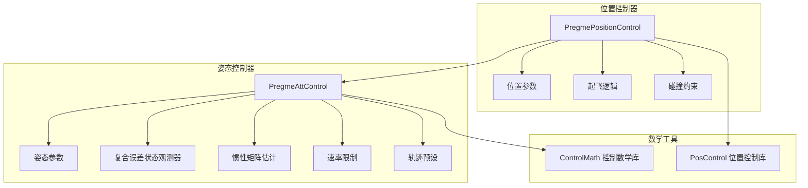

# PreGME 控制器概述

PreGME（Prescribed Performance Guidance and Management Estimator）是本项目的核心研究贡献，提供了一套完整的预设性能控制方案。

## 什么是预设性能控制（PPC）

预设性能控制是一种约束控制方法，通过预设的性能函数来限定系统的瞬态和稳态响应：

- **收敛速度** — 误差必须在预定时间内收敛到邻域
- **超调限制** — 响应超调不能超过预设边界
- **稳态精度** — 最终误差必须小于预定阈值

## 核心组件

## 文件结构

### 姿态控制器 `src/modules/pregme_att_control/`

| 文件 | 说明 |
|------|------|
| `pregme_att_control.cpp` | 主控制逻辑 |
| `pregme_att_control.hpp` | 头文件定义 |
| `pregme_att_control_params_en.yaml` | 英文参数参考 |
| `pregme_att_control_params_zh.yaml` | 中文参数参考 |
| `CMakeLists.txt` | 构建配置 |
| `Kconfig` | 编译选项 |

### 位置控制器 `src/modules/pregme_pos_control/`

| 文件 | 说明 |
|------|------|
| `PregmePositionControl.cpp/.hpp` | 主位置控制类 |
| `PosControl.cpp/.hpp` | 位置控制数学库 |
| `ControlMath.cpp/.hpp` | 通用控制数学运算 |
| `Takeoff.cpp/.hpp` | 起飞逻辑实现 |
| `pregme_pos_control_params_en.yaml` | 英文参数参考 |
| `pregme_pos_control_params_zh.yaml` | 中文参数参考 |

## 关键特性

### 滑模控制

PreGME 采用滑模控制理论，具有强鲁棒性，能够抵抗：
- 模型不确定性
- 外部扰动（风扰、机械臂反作用力）
- 参数摄动

### 变量增益 ESO

基于可变增益的扩张状态观测器（Variable-Gain ESO），实时估计并补偿系统总扰动。

### 惯性矩阵估计

在线估计飞行器的惯性矩阵变化，适应载荷变化（如机械臂抓取物体）。

## 相关论文

- [PreGME 理论论文 (PDF)](../../references/PreGME:%20Prescribed%20Performance%20Control%20of%20Aerial%20Manipulators%20based%20on%20Variable-Gain%20ESO.pdf)
- [PreGME 参数参考 (PDF)](../../references/PreGME:Parameter%20Reference.pdf)

## 下一步

- [姿态控制详解](attitude-control.md)
- [位置控制详解](position-control.md)
- [参数参考](parameters.md)
