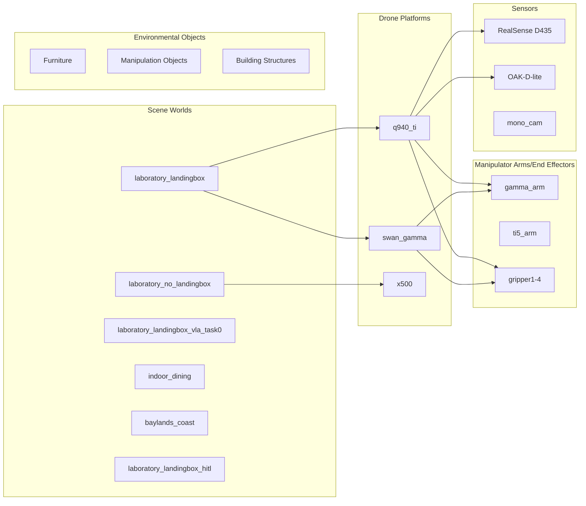

# Simulation Overview

VisionFlow-PX4 provides rich Gazebo simulation assets, supporting full-process simulation from controller development to system integration testing.

## Simulation Assets Overview



## Scene Worlds

| Scene | Description | Supported Platforms |
|------|------|---------|
| `laboratory_landingbox` | Main laboratory with landing box | q940_ti, swan_gamma |
| `laboratory_no_landingbox` | Laboratory without landing box | swan_gamma, x500 |
| `laboratory_landingbox_vla_task0` | Laboratory with VLA task | q940_ti |
| `laboratory_no_landingbox_vla_task0` | VLA scenario without landing box | swan_gamma |
| `indoor_dining` | Indoor dining environment | General |
| `baylands_coast` | Bay Area coastal outdoor environment | General |
| `laboratory_landingbox_hitl` | Hardware-in-the-loop version | q940_ti_hitl |

For detailed scene descriptions, please refer to [Scene Worlds](worlds/index.md).

## Drone Platforms

| Platform | Model | Description |
|------|------|------|
| q940_ti | Q940TI + 3-finger/4-finger gripper | Primary test platform |
| swan_gamma_v1/v2 | Swan + Gamma arm | Company version (old/new) |
| x500 | Standard X500 quadcopter | Baseline test platform |
| differential_rover | Differential drive rover | Ground robot platform |

## Simulation Configuration

All simulations enable the lockstep scheduler to ensure timing accuracy:

```bash
EXTRA_CMAKE_ARGS="-DENABLE_LOCKSTEP_SCHEDULER=ON"
```

## Next Steps

- [Scene Worlds Details](worlds/index.md)
- [Model Details](models/index.md)
- [Asset Usage Guide](assets-guide.md)
