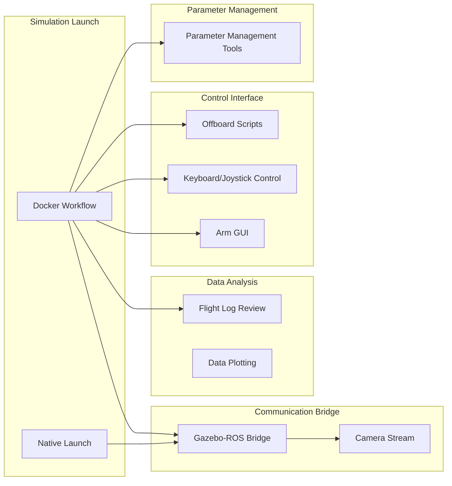

# Toolchain Overview

VisionFlow-PX4 provides a rich toolchain covering Docker workflows, flight log review, data stream bridging, robotic arm control, and UAV control scripts.

## Tool Overview



## Tool List

| Tool | Path | Description |
|------|------|------|
| Docker SITL | `docker/run_gz_sitl.sh` | Containerized simulation launch |
| Flight Log Review | `windshape_dev/flight_review/` | Web-based log analysis |
| Data Bridge | `windshape_dev/data_stream/gz_bridge/` | Gazebo <-> ROS2 bridge |
| Camera Stream | `windshape_dev/data_stream/image_stream/` | Camera video stream visualization |
| Arm GUI | `windshape_dev/arm_control/gamma_arm/` | Gamma arm control panel |
| Keyboard Control | `windshape_dev/uav_control/keyboard/` | Keyboard/joystick UAV control |
| Offboard Scripts | `windshape_dev/uav_control/offboard/` | Autonomous flight trajectory tracking |
| Data Plotting | `windshape_dev/data_plotting/local_position/` | Local position trajectory plotting |
| Parameter Tools | `windshape_dev/parameter/` | Parameter management and configuration files |

## Quick Reference

### Docker Workflow

```bash
bash docker/run_gz_sitl.sh --list          # List configurations
bash docker/run_gz_sitl.sh --profile "Entity 1"  # Launch
bash docker/into_gz_sitl.sh                # Enter container
```

### Data Bridge

```bash
bash windshape_dev/data_stream/gz_bridge/bridge_gz_ros.sh
```

### Flight Log Review

```bash
bash docker/run_flight_review.sh
```

### Arm Web Control

```bash
bash windshape_dev/arm_control/gamma_arm/gamma_arm_web_control.sh
```

## Next Steps

- [Docker Workflow Details](docker-workflow.md)
- [Flight Log Review](flight-review.md)
- [Data Stream Bridge](data-streaming.md)
- [Arm Control Panel](arm-control-gui.md)
- [UAV Control Scripts](uav-control-scripts.md)
