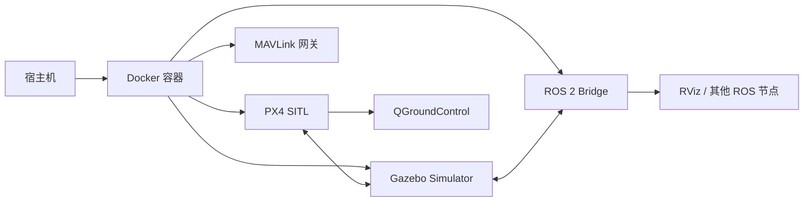

# Docker 启动指南

Docker 方式封装了完整的 ROS2 Humble + Gazebo 环境，是推荐的启动方式。

## 工作原理



## 快速启动

### 列出可用配置

```bash
bash docker/run_gz_sitl.sh --list
```

### 启动默认配置（Entity 1）

```bash
bash docker/run_gz_sitl.sh --profile "Entity 1"
```

### 指定配置启动

```bash
bash docker/run_gz_sitl.sh --profile "Entity 4"
```

### 重新构建镜像后启动

```bash
bash docker/run_gz_sitl.sh --build --profile "Entity 1"
```

## 可用仿真配置

| Profile | 描述 | 无人机型号 | 场景 |
|---------|------|-----------|------|
| Entity 1 | PreGME 季梦玉模型 | q940_ti_gripper4 | laboratory_landingbox |
| Entity 2 | PreGME VLA 任务 | q940_ti_gripper4 | laboratory_landingbox_vla_task0 |
| Entity 3 | PreGME 公司旧版本 | swan_gamma_v1 | laboratory_no_landingbox |
| Entity 4 | PreGME 公司新版本 | swan_gamma_v2 | laboratory_no_landingbox |
| Entity 5 | PreGME VLA 任务 | swan_gamma_v2 | laboratory_no_landingbox_vla_task0 |
| Entity 6 | X500 云台 | x500_gimbal | laboratory_no_landingbox |
| Entity 7 | 差动小车 | differential_rover | laboratory_no_landingbox |

## 进入运行中的容器

```bash
bash docker/into_gz_sitl.sh
```

进入容器后，可以：
- 运行 ROS 2 节点
- 调试 Gazebo 插件
- 修改参数并重启仿真

## Docker 架构详情

### compose.yaml 关键配置

```yaml
services:
  px4-humble-gz:
    build:
      context: ..
      dockerfile: docker/Dockerfile.humble-gz
    deploy:
      resources:
        reservations:
          devices:
            - driver: nvidia
              capabilities: [gpu]
    volumes:
      - ..:/workspace:rw
      - ccache:/home/px4/.ccache
      - gz_cache:/home/px4/.gz
    shm_size: '2gb'
    privileged: true
    network_mode: host
```

### 挂载卷说明

| 挂载路径 | 类型 | 用途 |
|---------|------|------|
| `/workspace` (原 `..`) | 双向读写 | 完整代码库访问 |
| `ccache` | 命名卷 | 编译器缓存加速构建 |
| `gz_cache` | 命名卷 | Gazebo 资源缓存 |
| `/dev/dri` | 设备 | GPU 直通 |
| `/tmp/.X11-unix` | 套接字 | X11 图形显示 |

## 故障排查

### 构建缓慢

使用 ccache 加速后续构建：

```bash
# 清除缓存后重新构建
docker volume rm visionflow-px4_ccache
bash docker/run_gz_sitl.sh --build
```

### GPU 不被识别

确保安装了 NVIDIA Container Toolkit：

```bash
# 检查安装
nvidia-smi

# 安装（如未安装）
distribution=$(. /etc/os-release;echo $ID$VERSION_ID)
curl -s -L https://nvidia.github.io/nvidia-docker/$distribution/nvidia-docker.repo | sudo tee /etc/yum.repos.d/nvidia-docker.repo
sudo yum install -y nvidia-docker2
sudo systemctl restart docker
```

### UCDR Header Stall

仿真启动时可能遇到 uORB ucdr header 停滞。系统会自动重试和恢复。如需手动干预：

```bash
# 清除 stale cache
bash docker/run_gz_sitl.sh --build --clean
```

### 图形界面不显示

确保 `DISPLAY` 环境变量正确设置，并且允许 Docker 容器访问 X server：

```bash
xhost +local:docker
```
