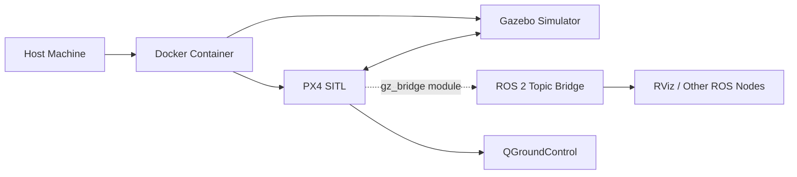

# Docker Launch Guide

The Docker method encapsulates a complete ROS2 Humble + Gazebo environment and is the recommended launch method.

## How It Works



## Quick Launch

### List Available Configurations

```bash
bash docker/run_gz_sitl.sh --list
```

### Launch with Default Configuration (Entity 1)

```bash
bash docker/run_gz_sitl.sh
```

### Launch with a Specified Configuration

```bash
bash docker/run_gz_sitl.sh --profile "Entity 4"
```

### Rebuild Image and Launch

```bash
bash docker/run_gz_sitl.sh --build --profile "Entity 1"
```

## Available Simulation Configurations

| Profile | Description | Drone Model | Scene |
|---------|------|-----------|------|
| Entity 1 | PreGME Jimengyu model | q940_ti_gripper4 | laboratory_landingbox |
| Entity 2 | PreGME VLA task | q940_ti_gripper4 | laboratory_landingbox_vla_task0 |
| Entity 3 | PreGME company legacy version | swan_gamma_v1 | laboratory_no_landingbox |
| Entity 4 | PreGME company new version | swan_gamma_v2 | laboratory_no_landingbox |
| Entity 5 | PreGME VLA task | swan_gamma_v2 | laboratory_no_landingbox_vla_task0 |
| Entity 6 | X500 Gimbal | x500_gimbal | laboratory_no_landingbox |
| Entity 7 | Differential Rover | differential_rover | laboratory_no_landingbox |

## Enter Running Container

```bash
bash docker/into_gz_sitl.sh
```

After entering the container, you can:
- Launch custom ROS 2 nodes
- Use the Gamma Arm Web Control panel (started automatically on entry)
- Run other debugging or development commands

## Docker Architecture Details

### Key compose.yaml Configuration

```yaml
services:
  px4-humble-gz:
    build:
      context: ..
      dockerfile: docker/Dockerfile.humble-gz
    image: visionflow-px4:humble-gz
    container_name: visionflow-px4-sitl
    working_dir: /workspace/VisionFlow-PX4
    volumes:
      - ..:/workspace/VisionFlow-PX4:rw
      - ./cache/ccache:/home/px4/.ccache:rw
      - ./cache/gz:/home/px4/.gz:rw
      - /tmp/.X11-unix:/tmp/.X11-unix:rw
      - /dev/dri:/dev/dri
    environment:
      - DISPLAY=${DISPLAY}
      - QT_X11_NO_MITSHM=1
      - QTWEBENGINE_DISABLE_SANDBOX=1
      - QTWEBENGINE_CHROMIUM_FLAGS=--no-sandbox --disable-gpu --disable-dev-shm-usage
      - XDG_RUNTIME_DIR=/tmp/runtime-px4
      - LIBGL_ALWAYS_SOFTWARE=0
      - CCACHE_DIR=/home/px4/.ccache
      - ROS_DISTRO=humble
      - AMENT_TRACE_SETUP_FILES=
      - NVIDIA_VISIBLE_DEVICES=all
      - NVIDIA_DRIVER_CAPABILITIES=all
    gpus: all
    privileged: true
    network_mode: host
    ipc: host
    shm_size: '2gb'
```

### compose.yaml Configuration Reference

| Configuration | Purpose |
|---------------|---------|
| `build.context` / `build.dockerfile` | Build context is the project root; uses `docker/Dockerfile.humble-gz` |
| `image` | The resulting image name: `visionflow-px4:humble-gz` |
| `container_name` | Fixed container name; `into_gz_sitl.sh` uses this to detect a running container |
| `working_dir` | Working directory inside the container, mapped to the host codebase |
| `environment.DISPLAY` | Forwards the host X11 display so Gazebo GUI renders on the host |
| `environment.ROS_DISTRO` | Declares ROS 2 distribution as Humble; affects package lookup paths |
| `environment.AMENT_TRACE_SETUP_FILES` | Cleared to prevent colcon install scripts from printing to the terminal |
| `environment.QTWEBENGINE_*` | Disables Chromium sandbox and GPU acceleration to prevent QtWebEngine crashes without a GPU |
| `environment.XDG_RUNTIME_DIR` | Provides a runtime directory for container processes, replacing the non-existent `/run/user/1000` |
| `environment.LIBGL_ALWAYS_SOFTWARE` | Set to `0` to prefer hardware rendering over software fallback |
| `environment.CCACHE_DIR` | Pins the ccache path to the container user's home, matching the volume mount |
| `environment.NVIDIA_VISIBLE_DEVICES` | Tells NVIDIA Container Toolkit to expose all host GPUs to the container |
| `environment.NVIDIA_DRIVER_CAPABILITIES` | Enables all NVIDIA driver capabilities (graphics, utility, compute) |
| `gpus: all` | Passes through the entire host GPU to the container via `nvidia-container-toolkit` |
| `privileged: true` | Runs the container in privileged mode, allowing direct control of Gazebo and hardware devices |
| `network_mode: host` | Shares the host network namespace so QGroundControl can connect to MAVLink ports on `127.0.0.1` |
| `ipc: host` | Shares the IPC namespace with the host, resolving ROS 2 shared-memory communication issues |
| `shm_size: '2gb'` | Sets `/dev/shm` to 2 GB, preventing DDS shared-memory allocation failures for large messages (e.g. images) |

### Mount Volume Description

| Mount Path | Type | Purpose |
|---------|------|------|
| `/workspace/VisionFlow-PX4` (mounted from host `..`) | Host directory (rw, bidirectional) | Full codebase access; changes inside container reflect on host immediately |
| `docker/cache/ccache` → `/home/px4/.ccache` | Host directory | ccache compiler cache for faster repeated builds |
| `docker/cache/gz` → `/home/px4/.gz` | Host directory | Gazebo model/material cache to avoid re-downloading |
| `/tmp/.X11-unix` | Host socket | X11 display forwarding |
| `/dev/dri` | Device | OpenGL / GPU passthrough |

## Troubleshooting

### Slow Build

Use ccache to speed up subsequent builds:

```bash
# Clear ccache and rebuild
rm -rf docker/cache/ccache/*
bash docker/run_gz_sitl.sh --build
```

### GPU Not Recognized

Ensure NVIDIA Container Toolkit is installed:

```bash
# Check installation
nvidia-smi

# Install (if not installed)
distribution=$(. /etc/os-release;echo $ID$VERSION_ID)
curl -s -L https://nvidia.github.io/nvidia-docker/$distribution/nvidia-docker.repo | sudo tee /etc/yum.repos.d/nvidia-docker.repo
sudo yum install -y nvidia-docker2
sudo systemctl restart docker
```

### UCDR Header Stall

You may encounter uORB ucdr header stalling during simulation startup. The system will automatically retry and recover. For manual intervention, clear the stale build cache:

```bash
# Clear stale PX4 SITL build cache and rebuild
rm -rf build/docker/px4_sitl_default
bash docker/run_gz_sitl.sh --build
```

### GUI Not Displaying

Ensure the `DISPLAY` environment variable is correctly set and the Docker container is allowed to access the X server:

```bash
xhost +local:docker
```
