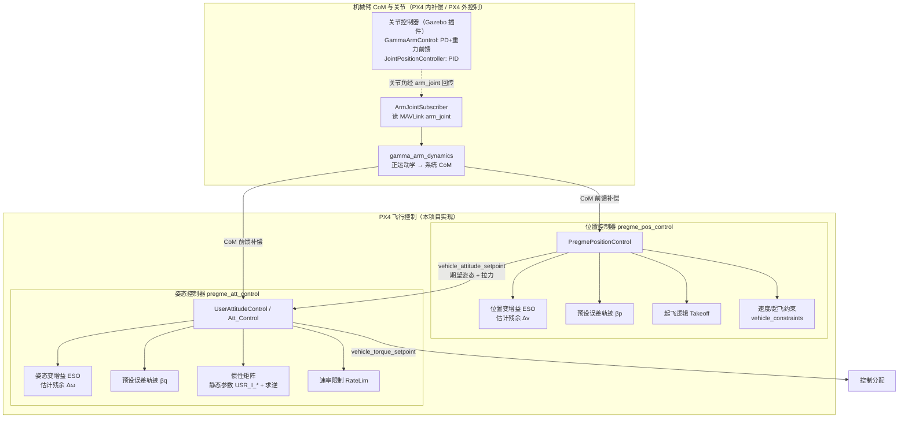

# PreGME 控制器概述

**PreGME**（*Prescribed Performance Control of Aerial Manipulators based on Variable-Gain ESO*）是一套面向**空中机械臂**（多旋翼 + 机械臂）的预设性能运动控制框架。其理论方法由 Ji 等人提出（arXiv:2512.22957，西湖大学 WINDY Lab）。**本项目的工作是将该控制框架在 PX4 Autopilot 中完整工程化实现，并围绕仿真、参数整定与后续功能开发进行扩展**，用自定义控制器 `pregme_att_control` / `pregme_pos_control` 替换 PX4 标准的 `mc_att_control` / `mc_pos_control`。

空中机械臂的多旋翼基座与机械臂之间存在显著的**动态耦合**（dynamic coupling）：机械臂运动会对基座产生耦合力 $\Delta_v$ 和耦合力矩 $\Delta_\omega$。PreGME 采用**解耦控制**思路，将该耦合视为未知扰动，通过以下两个核心机制实现高精度、强鲁棒的运动控制：

1. **变增益扩张状态观测器（Variable-Gain ESO）** —— 实时估计快速变化的动态耦合力/力矩，使系统能够应对机械臂大幅度、高速运动带来的强耦合。
2. **预设误差轨迹约束（Preset Error Trajectory）** —— 生成一条预设误差轨迹引导系统演化，保证跟踪误差始终被约束在预设性能包络内，从而实现高精度跟踪。

## 空中机械臂动力学模型

采用北-东-地惯性系 $\Sigma_I$ 与机体系 $\Sigma_B$。设基座位置、速度为 $p, v \in \mathbb{R}^3$，机体角速度为 $\omega \in \mathbb{R}^3$，姿态旋转矩阵 $R \in SO(3)$；$m_B$、$m_R$ 分别为四旋翼与机械臂质量，$I \in \mathbb{R}^{3\times3}$ 为基座惯性矩阵，$T$、$\tau$ 为总拉力与力矩。基座动力学为：

$$
\begin{aligned}
\dot{p} &= v, &
\dot{v} &= -\frac{T R n}{m_B + m_R} + g n + \Delta_v, \\
\dot{R} &= R[\omega]_\times, &
\dot{\omega} &= I^{-1}(\tau - \omega \times I\omega) + \Delta_\omega,
\end{aligned}
$$

其中 $n = [0,0,1]^T$，$g$ 为重力加速度，$[\cdot]_\times$ 为反对称矩阵变换。$\Delta_v$、$\Delta_\omega$ 是机械臂对基座施加的耦合力与力矩——由于其表达式包含无法被传感器精确测量的量（如基座角加速度、机械臂各关节角加速度），本方法将其**作为未知扰动处理**。当机械臂不存在（$m_R=0$，$\Delta_v=\Delta_\omega=0$）时，模型退化为标准四旋翼动力学。

## 变增益扩张状态观测器（Variable-Gain ESO）

相比传统固定增益 ESO，变增益 ESO 具有**更快的动态响应**和**更强的高频噪声抑制能力**。考虑标量系统 $\dot{x} = \Delta + u$，令 $y_1 = x$（状态）、$y_2 = \Delta$（扩张状态），引入内部辅助状态 $h$，观测器设计为：

$$
\dot{h} = \frac{\alpha\, g(e)}{\varepsilon} + u, \quad e = y_1 - h, \quad \hat{y}_2 = \frac{\alpha\, g(e)}{\varepsilon},
$$

其中 $\alpha > 0$，$\varepsilon \in (0,1)$ 为调节参数，$g(e)$ 为**变增益函数**：

$$
g(e) = \frac{\exp(e) + \exp(-e)}{w\,(\exp(e) + \exp(-e)) + d}\, e,
$$

$w, d > 0$ 为常数。该增益函数的设计有两重考量：**小误差时赋予低增益以抑制噪声，大误差时赋予高增益以快速收敛**；同时参数可灵活整定——增大 $d$ 降低增益下限以增强抗噪，减小 $w$ 提升增益上限以加快响应。在 $\Delta$ 及其导数 $\dot{\Delta}$ 有界的假设下，对任意 $\delta_f > 0$、$t_f > 0$，存在 $\varepsilon^* \in (0,1)$ 使得 $\forall \varepsilon \in (0, \varepsilon^*)$，估计误差满足 $|\Delta - \hat{\Delta}| \le \delta_f,\ \forall t \ge t_f$。

## 预设性能与预设误差轨迹

预设性能控制（PPC）通过预设的**性能包络**限定系统的瞬态与稳态响应，并生成一条**预设误差轨迹**引导实际跟踪误差在包络内演化。

**第一步——性能包络。** 上界函数 $\rho(t) \in \mathbb{R}^3$ 设计为指数收敛形式：

$$
\rho(t) = (\rho_0 - \rho_\infty)\exp(-l t) + \rho_\infty,
$$

下界为 $-\rho(t)$。其中 $\rho_0$ 由初始误差决定（须满足 $\rho_{0,i} > |\tilde{\xi}_i(0)|$ 以保证初始误差落在包络内），$l > 0$ 控制**收敛速度**（$l$ 越大收敛越快，由任务完成时间确定），$\rho_\infty$ 为**最大允许稳态误差**（其下限受传感器噪声/建模不确定性限制，上限由任务精度需求决定）。

**第二步——预设误差轨迹。** 定义 $b = l\tilde{\xi}(0) + \dot{\tilde{\xi}}(0)$，预设误差轨迹 $\beta(t) \in \mathbb{R}^3$ 为：

$$
\beta_i(t) = \beta_i(0)\exp(-l t) + \frac{b_i}{c_i}\big(1 - \exp(-c_i t)\big)\exp(-l t),
$$

其中 $\beta_i(0) = \tilde{\xi}_i(0)$。该轨迹**光滑且无奇异**，适当选取 $c_i$ 可保证 $\beta_i(t)$ 始终位于性能包络内：取正常数 $\epsilon_i < \min\{\rho_{\infty,i},\ \rho_{0,i} - |\tilde{\xi}_i(0)|\}$，只要 $c_i > |b_i| / (\rho_{0,i} - |\tilde{\xi}_i(0)| - \epsilon_i)$，即有 $|\beta_i(t)| < \rho_i(t) - \epsilon_i,\ \forall t \ge 0$。

## 位置控制（Position Control）

位置动力学写为紧凑形式 $\dot{p} = v,\ \dot{v} = u_v + \Delta_v$，其中 $u_v = g n - T/(m_B + m_R)$。**位置 ESO** 利用可测速度 $v$ 估计耦合力 $\hat{\Delta}_v$（对每个分量套用上述变增益 ESO）。

控制律分两步设计。定义位置误差 $\tilde{p} = p - p_d$，及 $z_p = \tilde{p} - \beta_p$，滑模向量为：

$$
s_p = \dot{z}_p + \Lambda_p z_p,
$$

$\Lambda_p \in \mathbb{R}^{3\times3}$ 为正定对角阵。**控制力输入**设计为：

$$
\mathbf{T} = (m_B + m_R)\big(g n + \hat{\Delta}_v - \ddot{p}_d - \ddot{\beta}_p + \Lambda_p \dot{z}_p + K_p s_p\big),
$$

其中 $K_p \in \mathbb{R}^{3\times3}$ 为正定对角阵，总拉力取 $T = \|\mathbf{T}\|$。**定理 1** 表明：在 $\Delta_v$、$\dot{\Delta}_v$ 有界且参数满足相应条件时，位置跟踪误差始终位于性能包络内，即 $|\tilde{p}_i(t)| < \rho_{p,i}(t),\ \forall t \ge 0$。稳态偏差与 $[\Lambda_p]_{i,i}$、$\lambda_{\min}(K_p)$ 成反比，故可直接增大 $\Lambda_p$、$K_p$ 来减小偏差。

## 姿态控制（Attitude Control）

姿态动力学写为 $\dot{R} = R[\omega]_\times,\ \dot{\omega} = u_\omega + \Delta_\omega$，其中 $u_\omega = I^{-1}(\tau - \omega \times I\omega)$。**姿态 ESO** 利用可测角速度 $\omega$ 估计耦合力矩 $\hat{\Delta}_\omega$。

由期望旋转矩阵 $R_d$ 与期望偏航 $\psi_d$ 构造期望姿态，定义旋转误差 $\tilde{R} = R_d^T R \in SO(3)$ 及其四元数误差 $\tilde{q} = [\tilde{q}_0, \tilde{q}_v^T]^T$：

$$
\tilde{q}_0 = \frac{1}{2}\sqrt{1 + \operatorname{tr}(\tilde{R})}, \quad \tilde{q}_v = \frac{1}{4\tilde{q}_0}[\tilde{R} - \tilde{R}^T]^\vee.
$$

对 $\tilde{q}_v$ 求二阶导并代入姿态动力学，可整理为 $\ddot{\tilde{q}}_v = f(\tilde{q}_v, \dot{\tilde{q}}_v) + \tfrac{1}{2}Q I^{-1}\tau + \tfrac{1}{2}Q\Delta_\omega$，其中 $Q = \tilde{q}_0 E_3 + [\tilde{q}_v]_\times$。定义 $z_q = \tilde{q}_v - \beta_q$，滑模向量为：

$$
s_q = \dot{z}_q + \Lambda_q z_q.
$$

**控制力矩输入**设计为：

$$
\tau = 2 I Q^{-1}\Big(-f(\tilde{q}_v, \dot{\tilde{q}}_v) - \tfrac{1}{2}Q\hat{\Delta}_\omega + \ddot{\beta}_q - \Lambda_q \dot{z}_q - K_q s_q\Big),
$$

其中 $K_q \in \mathbb{R}^{3\times3}$ 为正定对角阵。$Q$ 在控制计算中可逆（其奇异仅在姿态误差达 $180^\circ$ 时出现，实际控制场景中不会发生）。**定理 2** 表明：姿态跟踪误差 $\tilde{q}_v$ 同样始终位于性能包络内。

## 控制系统架构

论文提出的框架包含两部分：多旋翼基座的**飞行控制**与机械臂的**关节控制**。**在本项目的 PX4 实现中，两个 `pregme_*` 模块只承担飞行控制与机械臂质心（CoM）耦合前馈补偿；机械臂关节的闭环控制不在 PX4 内，而是由仿真侧的独立控制器完成。**

**飞行控制（PX4 内，级联结构）。** 位置控制器 `PregmePositionControl` 计算控制力矢量 $\mathbf{T}$，经 `ControlMath::thrustToAttitude` 转换为期望姿态四元数与总拉力，通过 uORB topic `vehicle_attitude_setpoint` 下发给姿态控制器 `UserAttitudeControl`（内部控制算法类 `Att_Control`）；姿态控制器计算控制力矩，通过 `vehicle_torque_setpoint` 下发给控制分配。位置环与姿态环各内嵌一个变增益 ESO，分别估计**残余**耦合力 $\Delta_v$ 与耦合力矩 $\Delta_\omega$ 并反馈到对应控制律。

**CoM 耦合补偿（PX4 内）。** `gamma_arm_dynamics` 由 6 个关节角做正运动学算出 UAV+机械臂系统总质心，位置环据此补偿向心加速度项、姿态环补偿重力矩项（开关 `PREGME_COMCP_EN` / `USR_COM_COMP_EN`）。已知的 CoM 耦合被显式补偿后并入 ESO 输入，因此 ESO 只需估计残余未知扰动。关节角本身由 PX4 通过 MAVLink `DEBUG_FLOAT_ARRAY`（name=`arm_joint`）读取（`ArmJointSubscriber`），仅用于该补偿，PX4 不对关节做闭环控制。

**关节控制（PX4 外，仿真插件）。** 期望关节角 $\Theta_d$ 经 Web/GUI 与 `ros_gz_bridge` 下发，关节闭环由 Gazebo 插件实现：`GammaArmControl`（PD + 重力前馈）或 `JointPositionController`（标准 PID），输出关节力矩到仿真模型。



> **说明**：本仓库源码中仅见 `arm_joint` 的**订阅**约定（`ArmJointSubscriber`），未见把关节角以该名称发布到 MAVLink 的发布方，发布可能位于外部工具或未纳管脚本中。

## 文件结构

按功能分三组，仅列核心 `.cpp/.hpp`（构建脚本、Kconfig、参数 YAML 从略）：

```
PreGME 控制器
├── 位置控制  src/modules/pregme_pos_control/
│   ├── PregmePositionControl.{hpp,cpp}   # PX4 主模块（ScheduledWorkItem）：主循环、发布姿态设定点
│   ├── PosControl.{hpp,cpp}              # 位置控制律：滑模 + 预设轨迹 + 变增益 ESO + CoM 速度补偿
│   ├── ControlMath.{hpp,cpp}             # thrustToAttitude / limitTilt 等无状态数学工具
│   └── Takeoff.{hpp,cpp}                 # 起飞推力斜坡状态机
├── 姿态控制  src/modules/pregme_att_control/
│   ├── pregme_att_control.{hpp,cpp}      # PX4 主模块 UserAttitudeControl（WorkItem）：发布力矩设定点
│   └── Att_control/Att_control.{hpp,cpp} # 姿态控制律 Att_Control：四元数误差滑模 + 预设轨迹 + ESO + CoM 力矩补偿
└── 机械臂动力学  src/lib/gamma_arm_dynamics/
    ├── gamma_arm_dynamics.{hpp,cpp}      # 正运动学算系统质心（computeComStateInBody）+ 默认模型参数
    └── ArmJointSubscriber.{hpp,cpp}      # 单例：读 MAVLink debug_array(arm_joint) → 缓存系统质心
```

### 位置控制核心函数

**`PregmePositionControl.{hpp,cpp}`** —— PX4 主模块，订阅本地位置/轨迹，驱动位置控制律并发布姿态设定点。

| 函数 | 职责 |
|------|------|
| `init()` | 注册 `vehicle_local_position` 回调，挂入工作队列 |
| `parameters_update()` | 拉取全部 `PREGME_*` 参数下发到 `PosControl`（增益、ESO、预设轨迹、限幅、悬停油门、CoM 补偿开关） |
| `set_vehicle_states()` | 将 `vehicle_local_position` 转为控制器状态（位置/速度/加速度/yaw，含速度微分滤波） |
| `Run()` | 主循环：读轨迹 → `_control.update()` → 起飞斜坡 → 着陆推力限制 → 发布 `vehicle_attitude_setpoint` |
| `slew_thrust_z()` / `limit_thrust_during_landing()` | z 推力压摆率限制、着陆阶段限推与积分复位 |
| `failsafe()` | 无有效设定点时生成安全下降设定点 |

**`PosControl.{hpp,cpp}`** —— 位置控制算法库（滑模 + 预设误差轨迹 + 变增益 ESO）。

| 函数 | 职责 |
|------|------|
| `update(dt)` | 单周期入口，调用控制律并校验有限性 |
| `_positionControl(dt)` | 核心律：位置/速度误差 → 预设轨迹 → 滑模面 → 控制力矢量，叠加 CoM 向心补偿 $\Delta_v=-R[\omega\times(\omega\times p_C^B)]$，倾角/推力限幅 |
| `PositionCESO()` / `PositionCESO_function_g()` | 变增益 ESO 及其非线性增益函数 $g(e)$，估计速度与残余扰动 |
| `setPresetTraj(e0, ev0)` | 由初始误差生成预设误差收敛轨迹 $\beta,\dot\beta,\ddot\beta$ |
| `setBodyState()` | 注入机体姿态/角速度供 CoM 补偿 |
| `getAttitudeSetpoint()` | 由控制力矢量 + yaw 经 `thrustToAttitude` 生成姿态设定点 |

**`ControlMath.{hpp,cpp}`** —— 无状态数学工具：`thrustToAttitude()`（力矢量+yaw→姿态四元数）、`limitTilt()`（最大倾角限制）、`constrainXY()`（水平分量优先约束）、`cross_sphere_line()`（轨迹几何求交）及 NaN 保护工具。

**`Takeoff.{hpp,cpp}`** —— 起飞斜坡状态机：`updateTakeoffState()`（`disarmed→spoolup→ready→rampup→flight`）、`updateRamp()`（按斜坡返回渐增的起飞垂速）。

### 姿态控制核心函数

**`pregme_att_control.{hpp,cpp}`** —— PX4 主模块 `UserAttitudeControl`，订阅姿态设定点，跑姿态律并发布力矩。

| 函数 | 职责 |
|------|------|
| `init()` | 注册 `vehicle_attitude` 回调 |
| `parameters_updated()` | 拉取 `USR_*` 参数：`setInertiaMatrix`、`setControllerGain`、`setRateLimit`、ESO/预设轨迹、`setCoMCompensationEnabled` |
| `Run()` | 主循环：读 `vehicle_attitude_setpoint` → `_attitude_control.update()` → 发布 `vehicle_torque_setpoint` |
| `generate_attitude_setpoint()` | 手动模式下由摇杆生成姿态设定点 |
| `publish_torque_thrust_setpoint()` | 归一化并发布力矩/推力设定点 |

**`Att_control/Att_control.{hpp,cpp}`** —— 姿态控制算法类 `Att_Control`。

| 函数 | 职责 |
|------|------|
| `update()` | 对外单周期入口 |
| `runAttitudeControl()` | 核心律：四元数误差 → 预设轨迹 → 滑模面 → $\tau=2IQ^{-1}(\cdot)+\text{陀螺补偿}-I_b\Delta_\omega$ |
| `UsrAttitudeESO()` / `CESO_function_g()` | 角速度变增益 ESO 及其增益函数，估计残余耦合力矩 |
| `updateCouplingCompensation()` | 从 `ArmJointSubscriber` 读系统质心，算重力矩补偿 $\Delta_\omega=I_b^{-1}[m_{\text{total}}\,p_C^B\times(R^Tg)]$ |
| `setInertiaMatrix()` | 设惯性矩阵并预计算其逆 $I_b^{-1}$ |
| `setRateLimit()` / `setPresetTraj()` | 机体角速度限幅、预设误差轨迹配置 |

### 机械臂动力学核心函数

**`gamma_arm_dynamics.{hpp,cpp}`** —— 系统质心正运动学（`namespace gamma_arm`）。

| 函数 | 职责 |
|------|------|
| `computeComStateInBody(q[6], param)` | 由 6 关节角做 DH 正运动学连乘，加权算机械臂质心与系统总质心 $p_C^B$、总质量 $m_{\text{total}}$ |
| `makeDefaultParam()` | 构造默认无人机+机械臂惯量/DH/挂载参数 |

**`ArmJointSubscriber.{hpp,cpp}`** —— 单例，读 MAVLink 关节角并缓存质心供两控制环无锁读取。

| 函数 | 职责 |
|------|------|
| `instance()` | 单例访问 |
| `update()` | 轮询 `debug_array`(name=`arm_joint`) 取 6 关节角，调 `computeComStateInBody` 并原子缓存 |
| `getSystemCom()` / `getTotalMass()` | 返回缓存的系统总质心（机体系）与总质量 |

> **注**：`makeDefaultParam()` 在 `gamma_arm_dynamics.cpp` 与 `gamma_arm_dynamics_params.hpp` 中均有定义且参数值不同，实际链接使用的是 `.cpp` 版本（`kDefaultModelParam`）。

## 关键特性

### 预设性能保证

框架的头号特征（也是 "PreGME" 名称的由来）。通过预设的**性能包络** $\rho(t)$ 与**预设误差轨迹** $\beta(t)$ 约束系统演化，保证跟踪误差**始终**落在包络内（定理 1 / 定理 2）：
- **瞬态可预设** —— 收敛速度由 $l$ 决定（对应任务完成时间），初始误差保证落在包络内
- **稳态可预设** —— 最大允许稳态误差由 $\rho_\infty$ 设定，稳态偏差与 $\Lambda$、$K$ 成反比，可直接增大增益减小偏差
- 无超调越界 —— 误差不会突破 $\pm\rho(t)$ 边界

### 变增益 ESO 扰动估计

基于可变增益的扩张状态观测器，实时估计动态耦合并反馈补偿。相比固定增益 ESO：**小误差低增益抑噪、大误差高增益快收敛**，尤其适应机械臂快速大幅运动引起的强动态耦合（论文实测末端速度 1.02 m/s、加速度 5.10 m/s²）。位置环估计残余耦合力 $\Delta_v$、姿态环估计残余耦合力矩 $\Delta_\omega$。

### CoM 耦合前馈补偿（本项目工程重点）

`gamma_arm_dynamics` 由 6 关节角正运动学在线算出系统总质心，将**已知**的机械臂耦合显式前馈补偿：位置环补偿向心加速度项、姿态环补偿重力矩项（开关 `PREGME_COMCP_EN` / `USR_COM_COMP_EN`）。与 ESO 分工明确——**已知耦合前馈、残余未知扰动交给 ESO**，二者叠加提升补偿精度。

### 级联解耦控制架构

将多旋翼基座与机械臂视为独立子系统、把耦合当作扰动处理，无需精确完整的空中机械臂动力学模型。飞行控制采用位置环 → 姿态环级联结构，降低对模型与硬件的依赖，适用范围更广。

### 滑模控制律

位置/姿态控制律均建立在滑模面 $s = \dot{z} + \Lambda z$（$z$ 为误差与预设轨迹之差）之上，具强鲁棒性，能够抵抗模型不确定性、外部扰动（风扰、机械臂反作用力）与参数摄动。

> **实现说明：惯性矩阵为静态参数。** 姿态控制律需要基座惯性矩阵 $I$。本实现从静态参数 `USR_I_XX/YY/ZZ/XY/XZ/YZ` 读入并求逆使用（**非在线估计**）；载荷变化（如机械臂抓取物体）引起的耦合影响由变增益 ESO 与 CoM 前馈补偿共同处理。

## 参考资料

- [PreGME 理论论文 (PDF)](/references/pregme-paper.pdf) — Ji et al., *PreGME: Prescribed Performance Control of Aerial Manipulators based on Variable-Gain ESO*, arXiv:2512.22957
- [PreGME 参数参考 (PDF)](/references/pregme-parameter-reference.pdf)

## 下一步

- [姿态控制详解](attitude-control.md)
- [位置控制详解](position-control.md)
- [参数参考](parameters.md)

