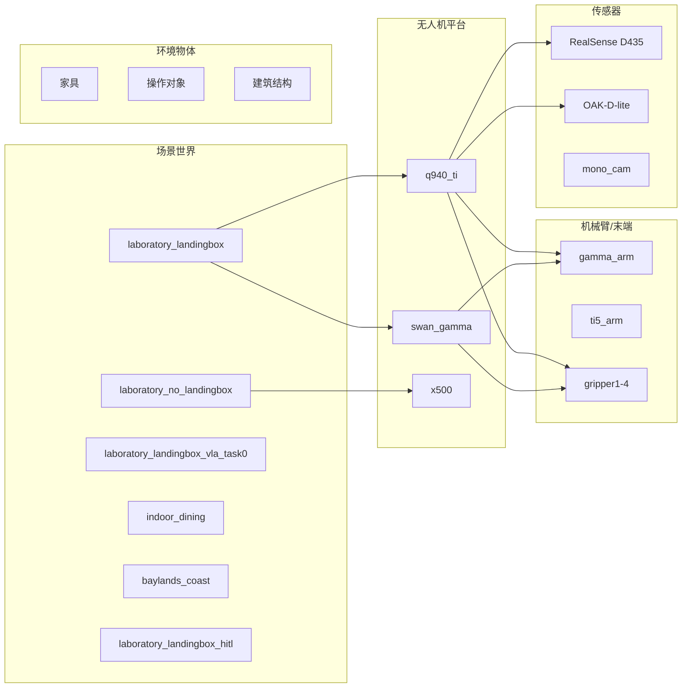

# 仿真概述

VisionFlow-PX4 提供了丰富的 Gazebo 仿真资产，支持从控制器开发到系统集成测试的全流程仿真。

## 仿真资产总览



## 场景世界

| 场景 | 说明 | 适用平台 |
|------|------|---------|
| `laboratory_landingbox` | 主实验室，带降落箱 | q940_ti, swan_gamma |
| `laboratory_no_landingbox` | 不带降落箱的实验室 | swan_gamma, x500 |
| `laboratory_landingbox_vla_task0` | 带 VLA 任务的实验室 | q940_ti |
| `laboratory_no_landingbox_vla_task0` | 不带降落箱的 VLA 场景 | swan_gamma |
| `indoor_dining` | 室内餐厅环境 | 通用 |
| `baylands_coast` | 湾区海岸户外环境 | 通用 |
| `laboratory_landingbox_hitl` | 硬件在环版本 | q940_ti_hitl |

详细场景说明请参考 [场景世界](worlds/index.md)。

## 无人机平台

| 平台 | 型号 | 说明 |
|------|------|------|
| q940_ti | Q940TI + 三指/四指夹爪 | 主要测试平台 |
| swan_gamma_v1/v2 | Swan + Gamma 机械臂 | 公司版本（旧/新） |
| x500 | 标准 X500 四旋翼 | 基准测试平台 |
| differential_rover | 差动驱动小车 | 地面机器人平台 |

## 仿真配置

所有仿真都启用了锁步调度器以确保时序精确：

```bash
EXTRA_CMAKE_ARGS="-DENABLE_LOCKSTEP_SCHEDULER=ON"
```

## 下一步

- [场景世界详解](worlds/index.md)
- [模型详解](models/index.md)
- [资产使用指南](assets-guide.md)
