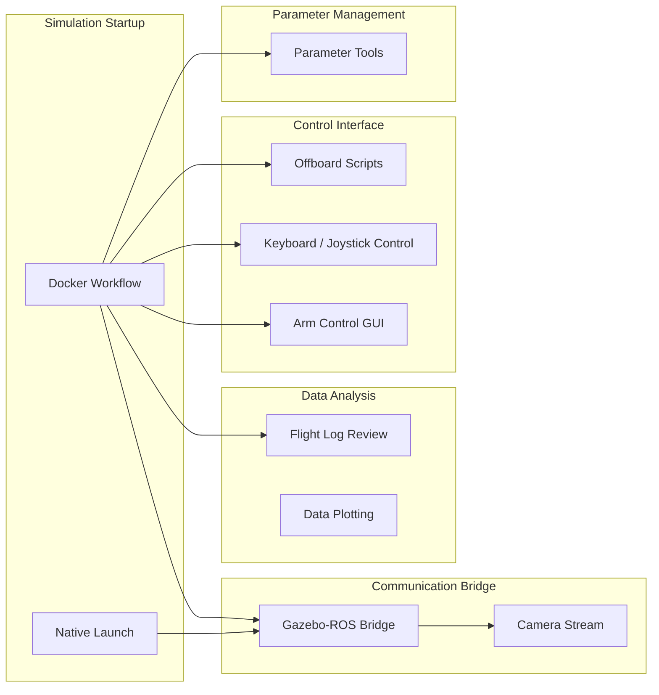

# Tools Overview

VisionFlow-PX4 provides a collection of development and operational tools covering Docker workflows, flight log review, data streaming, arm control, and UAV offboard scripts.

## Tool Overview



## Tool List

| Tool | Path | Description |
|------|------|------|
| Docker SITL | `docker/run_gz_sitl.sh` | Containerized simulation launch |
| Flight Log Review | `windshape_dev/flight_review/` | Web-based log analysis |
| Data Bridge | `windshape_dev/image_stream/bridge_gz_ros.sh` | Gazebo ↔ ROS2 topic bridge |
| Camera Stream | `windshape_dev/image_stream/camera_stream.sh` | Camera video streaming monitor |
| Arm Web GUI | `windshape_dev/arm_control/gamma_arm/` | Gamma arm web control panel |
| Keyboard Control | `windshape_dev/uav_control/keyboard/keyboard_control.py` | Keyboard UAV control via MAVROS |
| Joystick Control | `windshape_dev/uav_control/keyboard/wfly_joystick_control.py` | WFLY joystick UAV control |
| Offboard Scripts | `windshape_dev/uav_control/offboard/` | Automated trajectory tracking |
| Data Plotting | `windshape_dev/data_plotting/local_position/odom_plotter.py` | Local position trajectory plot |
| Parameter Tools | `windshape_dev/parameter/` | Parameter management and config files |

## Quick Reference

### Docker Workflow

```bash
bash docker/run_gz_sitl.sh --list           # List profiles
bash docker/run_gz_sitl.sh --profile "Entity 1"  # Launch
bash docker/into_gz_sitl.sh                 # Enter container
```

### Data Bridge (Gazebo ↔ ROS2)

```bash
bash windshape_dev/image_stream/bridge_gz_ros.sh
```

### Flight Log Review

```bash
bash docker/run_flight_review.sh
```

### Gamma Arm Web Control

```bash
bash windshape_dev/arm_control/gamma_arm/gamma_arm_web_control.sh
```

## Next Steps

- [Docker Workflow Details](tools/docker-workflow.md)
- [Flight Log Review](tools/flight-review.md)
- [Data Streaming & Bridge](tools/data-streaming.md)
- [Arm Control GUI](tools/arm-control-gui.md)
- [UAV Control Scripts](tools/uav-control-scripts.md)
