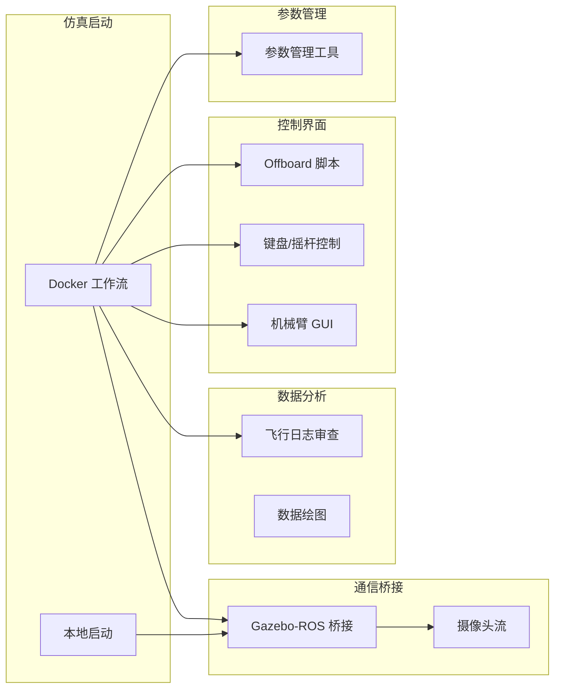

# 工具链总览

VisionFlow-PX4 提供了丰富的工具链，涵盖 Docker 工作流、飞行日志审查、数据流桥接、机械臂控制和 UAV 控制脚本。

## 工具概览



## 工具列表

| 工具 | 路径 | 说明 |
|------|------|------|
| Docker SITL | `docker/run_gz_sitl.sh` | 容器化仿真启动 |
| 飞行日志审查 | `windshape_dev/flight_review/` | Web 界面日志分析 |
| 数据桥接 | `windshape_dev/data_stream/gz_bridge/` | Gazebo ↔ ROS2 桥接 |
| 摄像头流 | `windshape_dev/data_stream/image_stream/` | 摄像头视频流可视化 |
| 机械臂 GUI | `windshape_dev/arm_control/gamma_arm/` | Gamma 机械臂控制面板 |
| 键盘控制 | `windshape_dev/uav_control/keyboard/` | 键盘/摇杆 UAV 控制 |
| Offboard 脚本 | `windshape_dev/uav_control/offboard/` | 自动飞行轨迹跟踪 |
| 数据绘图 | `windshape_dev/data_plotting/local_position/` | 局部位置航迹绘图 |
| 参数工具 | `windshape_dev/parameter/` | 参数管理和配置文件 |

## 快速参考

### Docker 工作流

```bash
bash docker/run_gz_sitl.sh --list          # 列出配置
bash docker/run_gz_sitl.sh --profile "Entity 1"  # 启动
bash docker/into_gz_sitl.sh                # 进入容器
```

### 数据桥接

```bash
bash windshape_dev/data_stream/gz_bridge/bridge_gz_ros.sh
```

### 飞行日志审查

```bash
bash docker/run_flight_review.sh
```

### 机械臂 Web 控制

```bash
bash windshape_dev/arm_control/gamma_arm/gamma_arm_web_control.sh
```

## 下一步

- [Docker 工作流详解](docker-workflow.md)
- [飞行日志审查](flight-review.md)
- [数据流桥接](data-streaming.md)
- [机械臂控制面板](arm-control-gui.md)
- [UAV 控制脚本](uav-control-scripts.md)
