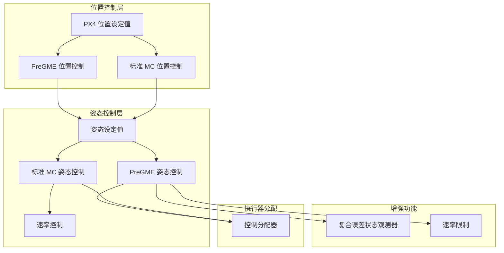

# 控制栈

控制栈是 VisionFlow-PX4 的核心，负责将状态估计转换为执行器命令。

## 控制器架构



## PreGME 控制器

PreGME（Prescribed Performance Guidance and Management Estimator）是本项目的主要研究贡献。

### 预设性能控制（PPC）

PPC 通过变换函数将约束误差映射到无约束空间，确保系统响应始终在预设的性能边界内：

- **收敛速度** — 通过预设函数控制误差收敛速率
- **超调量** — 严格限制最大超调
- **稳态精度** — 保证最终误差小于预定阈值

### 复合误差状态观测器（CESO）

CESO 估计并补偿系统不确定性和外部扰动：

| 估计量 | 说明 |
|--------|------|
| 惯性矩阵 | 在线估计飞行器惯性参数变化 |
| 扰动观测 | 估计风扰、机械臂反作用力等 |
| 轨迹预设 | 支持多种预设轨迹模式 |

### 参数文件

- 英文参数参考：`src/modules/pregme_att_control/pregme_att_control_params_en.yaml`
- 中文参数参考：`src/modules/pregme_att_control/pregme_att_control_params_zh.yaml`

## 标准控制器

标准 PX4 控制器（MPC）保留用于对比测试和降级运行：

| 模块 | 说明 |
|------|------|
| `mc_att_control` | 多旋翼姿态控制（MPC） |
| `mc_pos_control` | 多旋翼位置控制（MPC） |
| `mc_rate_control` | 多旋翼速率控制 |
| `mc_autotune_attitude_control` | 自整定姿态控制 |

## 切换机制

通过空机配置文件（airframe）选择使用的控制器：

```bash
# 使用 PreGME 控制器（默认）
4004_gz_q940_ti_gripper3  # 使用 pregme_att_control + pregme_pos_control

# 使用标准控制器
4001_gz_x500              # 使用 mc_att_control + mc_pos_control
```
