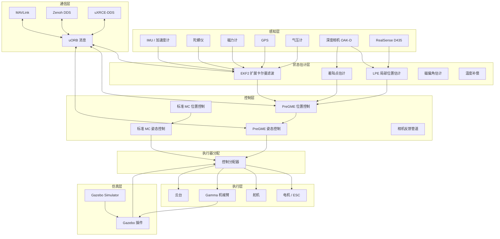

# 系统架构概述

VisionFlow-PX4 是在 PX4 Autopilot V1.17.0 基础上定制的分支，专为无人机机械臂协同操作仿真设计。

## 整体架构

## 关键设计决策

### 双控制器共存

标准 PX4 控制器（`mc_att_control` / `mc_pos_control`）与 PreGME 控制器（`pregme_att_control` / `pregme_pos_control`）同时存在，通过空机配置选择使用哪个控制器。

### 模块化架构

每个控制功能独立为一个 PX4 模块，通过 uORB 消息进行通信。这种设计使得：
- 新控制器可以并行开发而不影响现有功能
- 传感器模拟器可以独立于控制逻辑
- 机械臂集成通过独立的 Gazebo 插件实现

### 多层仿真支持

| 仿真级别 | 说明 | 适用场景 |
|---------|------|---------|
| SITL | 软件在环，PX4 在主机运行 | 控制器开发、参数调优 |
| Gazebo | 完整物理仿真 | 系统集成测试 |
| HITL | 硬件在环，真实飞控接入 | 固件验证、硬件测试 |
| SIH | 仿真器在环 | 算法原型验证 |

## 与标准 PX4 的差异

1. **PreGME 控制器** — 滑模 PPC 替代标准 MPC
2. **Gamma 机械臂集成** — `gamma_arm_dynamics` 桥接飞控与机械臂
3. **增强仿真栈** — 自定义世界、模型、插件
4. **ROS2 原生集成** — Zenoh、uXRCE-DDS、Gazebo-ROS Bridge
5. **相机反馈管道** — OAK-D 与 Intel RealSense，支持实时目标检测与地理标记
