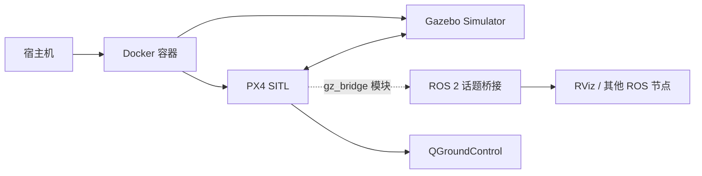

# Docker 启动指南

Docker 方式封装了完整的 ROS2 Humble + Gazebo 环境，是推荐的启动方式。

## 工作原理



## 快速启动

### 列出可用配置

```bash
bash docker/run_gz_sitl.sh --list
```

### 启动默认配置（Entity 1）

```bash
bash docker/run_gz_sitl.sh
```

### 指定配置启动

```bash
bash docker/run_gz_sitl.sh --profile "Entity 4"
```

### 重新构建镜像后启动

```bash
bash docker/run_gz_sitl.sh --build --profile "Entity 1"
```

## 可用仿真配置

| Profile | 描述 | 无人机型号 | 场景 |
|---------|------|-----------|------|
| Entity 1 | PreGME 季梦玉模型 | q940_ti_gripper4 | laboratory_landingbox |
| Entity 2 | PreGME VLA 任务 | q940_ti_gripper4 | laboratory_landingbox_vla_task0 |
| Entity 3 | PreGME 公司旧版本 | swan_gamma_v1 | laboratory_no_landingbox |
| Entity 4 | PreGME 公司新版本 | swan_gamma_v2 | laboratory_no_landingbox |
| Entity 5 | PreGME VLA 任务 | swan_gamma_v2 | laboratory_no_landingbox_vla_task0 |
| Entity 6 | X500 云台 | x500_gimbal | laboratory_no_landingbox |
| Entity 7 | 差动小车 | differential_rover | laboratory_no_landingbox |

## 进入运行中的容器

```bash
bash docker/into_gz_sitl.sh
```

进入容器后，可以：
- 启动自定义的 ROS 2 节点
- 使用默认的机械臂 Web 控制面板（已自动启动）
- 执行其他调试或开发命令

## Docker 架构详情

### compose.yaml 关键配置

```yaml
services:
  px4-humble-gz:
    build:
      context: ..
      dockerfile: docker/Dockerfile.humble-gz
    image: visionflow-px4:humble-gz
    container_name: visionflow-px4-sitl
    working_dir: /workspace/VisionFlow-PX4
    volumes:
      - ..:/workspace/VisionFlow-PX4:rw
      - ./cache/ccache:/home/px4/.ccache:rw
      - ./cache/gz:/home/px4/.gz:rw
      - /tmp/.X11-unix:/tmp/.X11-unix:rw
      - /dev/dri:/dev/dri
    environment:
      - DISPLAY=${DISPLAY}
      - QT_X11_NO_MITSHM=1
      - QTWEBENGINE_DISABLE_SANDBOX=1
      - QTWEBENGINE_CHROMIUM_FLAGS=--no-sandbox --disable-gpu --disable-dev-shm-usage
      - XDG_RUNTIME_DIR=/tmp/runtime-px4
      - LIBGL_ALWAYS_SOFTWARE=0
      - CCACHE_DIR=/home/px4/.ccache
      - ROS_DISTRO=humble
      - AMENT_TRACE_SETUP_FILES=
      - NVIDIA_VISIBLE_DEVICES=all
      - NVIDIA_DRIVER_CAPABILITIES=all
    gpus: all
    privileged: true
    network_mode: host
    ipc: host
    shm_size: '2gb'
```

### compose.yaml 配置项说明

| 配置项 | 作用 |
|--------|------|
| `build.context` / `build.dockerfile` | 指定 Docker 镜像构建上下文为项目根目录，使用 `docker/Dockerfile.humble-gz` 构建 |
| `image` | 构建后的镜像名称，`visionflow-px4:humble-gz` |
| `container_name` | 容器固定名称，`into_gz_sitl.sh` 通过此名称识别正在运行的容器 |
| `working_dir` | 容器内工作目录，与宿主机代码库路径对应 |
| `environment.DISPLAY` | 将宿主机 X11 显示转发到容器，使 Gazebo GUI 能在宿主机显示 |
| `environment.ROS_DISTRO` | 声明 ROS 2 版本为 Humble，影响包查找路径 |
| `environment.AMENT_TRACE_SETUP_FILES` | 清空该变量，避免 colcon 安装脚本输出干扰终端 |
| `environment.QTWEBENGINE_*` | 禁用 Chromium 沙箱并关闭 GPU 加速，防止 QtWebEngine 在无显卡环境中崩溃 |
| `environment.XDG_RUNTIME_DIR` | 为容器内进程提供运行时目录，替代默认的 `/run/user/1000`（容器内不存在） |
| `environment.LIBGL_ALWAYS_SOFTWARE` | 设为 `0`，优先使用硬件加速而非软件渲染 |
| `environment.CCACHE_DIR` | 将 ccache 缓存路径固定到容器内用户的 home 目录，与挂载卷对应 |
| `environment.NVIDIA_VISIBLE_DEVICES` | 向 NVIDIA Container Toolkit 声明所有 GPU 对容器可见 |
| `environment.NVIDIA_DRIVER_CAPABILITIES` | 启用所有 NVIDIA 驱动功能（graphics、utility、compute） |
| `gpus: all` | 通过 `nvidia-container-toolkit` 将整个宿主机的 GPU 直通给容器 |
| `privileged: true` | 以特权模式运行，允许容器直接操控 Gazebo 和硬件设备 |
| `network_mode: host` | 容器与宿主机共享网络命名空间，方便 QGroundControl 通过 `127.0.0.1` 直接访问 MAVLink 端口 |
| `ipc: host` | 与宿主机共享 IPC 命名空间，解决 ROS 2 shared memory 通信问题 |
| `shm_size: '2gb'` | 将 `/dev/shm` 大小设为 2GB，避免大型消息（如图像）在 DDS 共享内存中分配失败 |

### 挂载卷说明

| 挂载路径 | 类型 | 用途 |
|---------|------|------|
| `/workspace/VisionFlow-PX4`（映射自宿主机 `..`） | 宿主机目录（双向读写） | 完整代码库访问，容器内修改立即反映到宿主机 |
| `docker/cache/ccache` → `/home/px4/.ccache` | 宿主机目录 | ccache 编译器缓存，跨次构建加速 |
| `docker/cache/gz` → `/home/px4/.gz` | 宿主机目录 | Gazebo 模型/材质缓存，避免重复下载 |
| `/tmp/.X11-unix` | 宿主机套接字 | X11 图形显示转发 |
| `/dev/dri` | 设备 | OpenGL/GPU 直通 |

## 故障排查

### 构建缓慢

使用 ccache 加速后续构建：

```bash
# 清除 ccache 缓存后重新构建
rm -rf docker/cache/ccache/*
bash docker/run_gz_sitl.sh --build
```

### GPU 不被识别

确保安装了 NVIDIA Container Toolkit：

```bash
# 检查安装
nvidia-smi

# 安装（如未安装）
distribution=$(. /etc/os-release;echo $ID$VERSION_ID)
curl -s -L https://nvidia.github.io/nvidia-docker/$distribution/nvidia-docker.repo | sudo tee /etc/yum.repos.d/nvidia-docker.repo
sudo yum install -y nvidia-docker2
sudo systemctl restart docker
```

### UCDR Header Stall

仿真启动时可能遇到 uORB ucdr header 停滞。系统会自动重试和恢复。如需要手动干预，可清除构建缓存：

```bash
# 清除 stale PX4 SITL 构建缓存后重新构建
rm -rf build/docker/px4_sitl_default
bash docker/run_gz_sitl.sh --build
```

### 图形界面不显示

确保 `DISPLAY` 环境变量正确设置，并且允许 Docker 容器访问 X server：

```bash
xhost +local:docker
```
