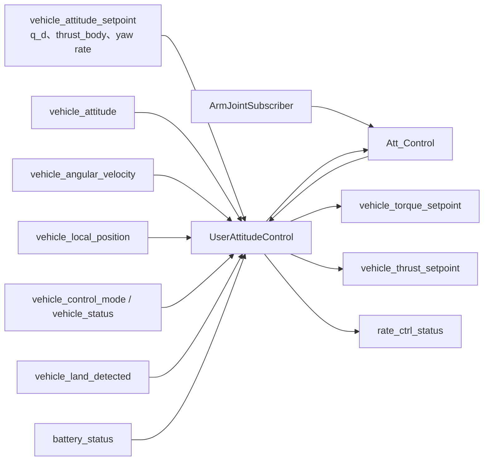

# PreGME 姿态控制详解

> 本页描述 `pregme_att_control` 和 `Att_Control` 的实际实现，包括四元数误差、预设轨迹、滑模控制、姿态 ESO、CoM 重力矩补偿、力矩归一化和安全保护

## 阅读指南

- [姿态控制模块分层与职责](#姿态控制模块分层与职责)
- [数据流框架示意图](#数据流框架示意图)
- [姿态误差与参考角速度](#姿态误差与参考角速度)
- [姿态控制律](#姿态控制律)
- [预设误差轨迹](#预设误差轨迹)
- [姿态 ESO](#姿态-eso)
- [CoM 重力矩补偿](#com-重力矩补偿)
- [输出归一化与安全保护](#输出归一化与安全保护)
- [uORB 接口](#uorb-接口)
- [参数整定顺序](#参数整定顺序)
- [诊断建议](#诊断建议)
- [论文与实现差异](#论文与实现差异)

## 姿态控制模块分层与职责

| 层次 | 类 | 职责 |
| :--- | :--- | :--- |
| PX4 模块层 | `UserAttitudeControl` | 读取状态和姿态设定值、参数更新、解锁/落地判断、电池缩放、力矩归一化与发布 |
| 算法层 | `Att_Control` | 四元数误差、预设轨迹、滑模控制、姿态 ESO、CoM 重力矩补偿 |
| CoM 数据层 | `ArmJointSubscriber` | 根据机械臂关节角更新系统总质心和总质量 |

<br>

> 正常情况下控制算法读取位置控制器发布的 `vehicle_attitude_setpoint`，计算 `vehicle_torque_setpoint` 和 `vehicle_thrust_setpoint`

## 数据流框架示意图



<br>

控制周期由 `vehicle_attitude` 回调触发，<br>
实际 `dt` 根据 `vehicle_angular_velocity.timestamp_sample` 计算并限制在：

$$
0.0002\ \mathrm{s}
\le \Delta t \le
0.02\ \mathrm{s}.
$$

## 姿态误差与参考角速度

### 四元数误差

源码定义

$$
\tilde{q}=q_d^{-1}\otimes q,
$$

其中：

- $q_d$ 为期望姿态；
- $q$ 为当前姿态；
- $\tilde{q}=[\tilde{q}_0,\tilde{q}_v^T]^T$。

若 $\tilde{q}_0<0$，源码将整个四元数取反，选择最短旋转表示，避免 quaternion unwinding。

### 奇异保护

姿态控制需要构造

$$
Q=\tilde{q}_0I_3+[\tilde{q}_v]_\times.
$$

当

$$
|\tilde{q}_0|<10^{-3}
$$

时，控制器认为接近 $180^\circ$ 姿态误差，复位 ESO 和预设轨迹并输出零力矩，避免对 $Q$ 求逆时数值不稳定。

### 参考角速度

论文允许一般的 $\omega_d$。源码的自动路径只构造偏航前馈：

$$
\omega_r
=
R(q)^{-1}e_3\,\dot\psi_d.
$$

然后逐轴进行速率限制。由于滚转和俯仰前馈没有从上游传入，正常自动路径中 $\omega_{r,x}$ 和 $\omega_{r,y}$ 通常为零。

角速度误差为

$$
\tilde{\omega}=\omega-\omega_r.
$$

四元数向量误差导数为

$$
\dot{\tilde{q}}_v
=
\frac{1}{2}Q\tilde{\omega}.
$$

## 姿态控制律

### 误差变换

源码使用

$$
z_q=\tilde{q}_v-k\beta_q,
\qquad
\dot{z}_q=\dot{\tilde{q}}_v-k\dot{\beta}_q,
$$

滑模变量为

$$
s_q=\dot{z}_q+\Lambda_qz_q.
$$

### 控制向量

内部控制向量为

$$
u_c
=
-K_qs_q
-\frac{1}{2}\dot{Q}\tilde{\omega}
-\Lambda_q\dot{z}_q
+k\ddot{\beta}_q.
$$

陀螺项为

$$
\tau_{\mathrm{gyro}}
=
\omega\times I\omega.
$$

最终力矩：

$$
\tau
=
2I Q^{-1}u_c
+
\omega\times I\omega
-
I\left(
\hat{\Delta}_{\omega,\mathrm{ESO}}
+
\Delta_{\omega,\mathrm{com}}
\right).
$$

该式与论文姿态控制律对应，但源码将已知 CoM 重力矩补偿和 ESO 残差估计显式相加。

### 增益作用

| 参数组 | 作用 |
| :--- | :--- |
| `USR_LAMBDA_Q_X/Y/Z` | $\Lambda_q$ 对角元素，控制姿态误差面收敛 |
| `USR_K_Q_X/Y/Z` | $K_q$ 对角元素，提高滑模变量反馈和抗扰能力 |
| `USR_I_*` | 惯性矩阵，决定力矩到角加速度的映射 |
| `USR_A_PRESET_K` | $k$，控制预设轨迹补偿参与程度 |

增益过大时，物理力矩会在模块层经 `USR_TAU_COE` 归一化后饱和，表现为控制误差不再随增益增加而改善。

## 预设误差轨迹

### 刷新判据

每个轴比较期望四元数向量部分：

$$
\left|
q_{d,\mathrm{last},i}
-
q_{d,i}
\right|
\ge
\varepsilon_{\mathrm{reset}}.
$$

满足条件时，该轴重新记录初始误差并从 $t=0$ 开始生成轨迹。

> 四元数向量分量不是欧拉角。相同的角度变化在不同姿态附近可能对应不同的分量变化，因此 `USR_A_PRESET_EP` 不应按“度”直接理解。

### 源码公式

先缩放初始误差：

$$
e_0=w\tilde{q}_v(0),
\qquad
\dot{e}_0=w\dot{\tilde{q}}_v(0).
$$

然后：

$$
b=le_0+\dot{e}_0,
\qquad
c=\frac{|b|}{0.1}+\varepsilon_{\mathrm{reset}}.
$$

轨迹及其导数为

$$
\begin{aligned}
\beta_q(t)
&=
e_0e^{-lt}
+
\frac{b}{c}\left(1-e^{-ct}\right)e^{-lt},\\
\dot{\beta}_q(t)
&=
-l\beta_q(t)+be^{-(l+c)t},\\
\ddot{\beta}_q(t)
&=
-l\dot{\beta}_q(t)-b(l+c)e^{-(l+c)t}.
\end{aligned}
$$

位置环和姿态环的 $c$ 启发式系数不同：位置使用 $|b|/2$，姿态使用 $|b|/0.1$。这会使姿态预设轨迹通常具有更快的附加衰减项。

## 姿态 ESO

### 结构

姿态 ESO 对每个轴执行：

$$
\begin{aligned}
e_\omega &= \omega-\xi,\\
\dot{\xi} &=
\frac{g(e_\omega,L)}{\varepsilon}
+
u_\omega,\\
\hat{\Delta}_\omega
&=
\frac{g(e_\omega,L)}{\varepsilon}.
\end{aligned}
$$

其中

$$
u_\omega
=
I^{-1}
\left(
\tau-\omega\times I\omega
\right)
+
\Delta_{\omega,\mathrm{com}}.
$$

已知 CoM 补偿被加到 ESO 输入中，因此观测器主要估计剩余扰动。

变增益函数为

$$
g(e,L)
=
Le
\frac{e^e+e^{-e}}
{c_1\left(e^e+e^{-e}\right)+c_2}.
$$

源码保护包括：

- 误差限制到 $[-20,20]$；
- 指数输入限制到 $[-50,50]$；
- $\varepsilon\ge10^{-3}$；
- 分母不小于 $10^{-6}$；
- 最终扰动估计限制到 $[-20,20]$。

### 高度门限

控制律使用 ESO 估计的条件是

```text
PX4 NED z < -1 m
```

即飞行高度约高于 1 m。否则本周期用于控制的 `_usr_eso.delta_esti` 被置零。

该门限是 `kEsoEnableZ = -1.0f`，当前不可通过参数修改。

### 状态发布

`rate_ctrl_status` 的三个 `*_integ` 字段被复用于发布姿态 ESO 的三个扰动估计值。分析日志时，这些字段不代表传统 PID 积分项。

## CoM 重力矩补偿

姿态环读取系统质心 $p_C^B$ 和总质量 $m_{\mathrm{total}}$。

重力在机体系中的表示为

$$
g^B=R^Tg_n.
$$

质心偏移产生的重力矩为

$$
\tau_g
=
m_{\mathrm{total}}
p_C^B\times g^B.
$$

转换成角加速度补偿：

$$
\Delta_{\omega,\mathrm{com}}
=
I^{-1}\tau_g.
$$

当以下任一条件成立时补偿为零：

- `USR_COM_COMP_EN = false`；
- $\|p_C^B\|<10^{-6}$；
- 总质量小于 0.1 kg；
- 计算结果非有限数。

### 物理参数要求

补偿精度依赖：

- 机体系下 CoM 坐标方向正确；
- 总质量与仿真/实机一致；
- `USR_I_*` 与实际基座惯性矩阵一致；
- 姿态矩阵方向为 body → world

## 输出归一化与安全保护

### 力矩归一化

`Att_Control` 输出的 `_torque` 按

$$
\tau_{\mathrm{norm}}
=
\operatorname{sat}_{[-1,1]}
\left(
\frac{\tau}{\texttt{USR\_TAU\_COE}}
\right)
$$

转换成 `vehicle_torque_setpoint`。

因此：

- 增大 `USR_TAU_COE`：相同物理力矩对应更小的归一化输出；
- 减小 `USR_TAU_COE`：控制更强，但更容易饱和；
- 该参数不是惯性、力臂或电机常数，而是工程归一化比例。

### 推力路径

姿态模块不重新计算推力，而是读取上游 `vehicle_attitude_setpoint.thrust_body[2]`，限制到 $[0,1]$ 后发布 `vehicle_thrust_setpoint`。

### 解锁与预旋

| 状态 | 力矩 | 推力 |
| :--- | :---: | :---: |
| 未解锁 | 0 | 0 |
| 已解锁但未完成 `COM_SPOOLUP_TIME` | 0 | 0 |
| 已落地 | 0 | 保留上游推力值，通常由位置环地面保护归零 |
| 正常飞行 | 正常发布 | 正常发布 |

### 电池缩放

当 `USR_BAT_SCALE_EN=true` 且 `battery_status.scale>0` 时：

$$
\tau_{\mathrm{norm}}\leftarrow
s_{\mathrm{bat}}\tau_{\mathrm{norm}},
\qquad
T\leftarrow s_{\mathrm{bat}}T.
$$

缩放发生在首次 $[-1,1]$ 力矩限幅之后；源码没有再次对电池缩放后的力矩做饱和，最终是否裁剪取决于后续控制分配链路。

### 断路器

`CBRK_RATE_CTRL=121212` 时，模块不发布有效力矩和推力设定值。

### 无效状态保护

以下情况会输出零力矩并复位内部状态：

- 当前或期望四元数非有限；
- $|\tilde{q}_0|<10^{-3}$；
- 计算力矩出现 NaN/Inf；
- 姿态控制未使能；
- 车辆未解锁或不是旋翼机时复位 ESO/预设轨迹。

## 手动姿态路径

源码保留了：

- 手动 roll/pitch 倾角生成；
- 偏航积分；
- 油门曲线；
- Airmode 行为；
- 手动输入低通。

但主循环中

```cpp
const bool manual_stabilized = false;
```

因此当前版本不会进入 `generate_attitude_setpoint()`。以下参数在正常自动路径中没有实际作用：

- `USR_MAN_Y_MAX`
- `USR_MAN_TILT_TAU`
- `USR_MAN_TILT_MAX`
- `USR_MANTHR_MIN`
- `USR_THR_MAX`
- `USR_THR_HOVER`
- `USR_THR_CURVE`
- `USR_AIRMODE`

## uORB 话题接口

### 订阅话题

| Topic | 用途 |
| :--- | :--- |
| `vehicle_attitude` | 当前姿态并触发工作项 |
| `vehicle_angular_velocity` | 当前角速度和控制周期时间戳 |
| `vehicle_attitude_setpoint` | 期望姿态、推力和偏航速率 |
| `vehicle_local_position` | ESO 高度门限 |
| `vehicle_control_mode` | 姿态控制使能和解锁状态 |
| `vehicle_status` | 车辆类型、解锁和预旋状态 |
| `vehicle_land_detected` | 落地复位与力矩抑制 |
| `battery_status` | 电池缩放 |
| `manual_control_setpoint` | 保留的手动姿态路径 |

### 发布话题

| Topic | 内容 |
| :--- | :--- |
| `vehicle_torque_setpoint` | 归一化机体系力矩 |
| `vehicle_thrust_setpoint` | 上游总推力 |
| `rate_ctrl_status` | 复用字段发布 ESO 扰动估计 |
| `vehicle_attitude_setpoint` | 仅手动姿态生成路径使用；当前路径关闭 |

## 参数整定建议

### 惯性与力矩比例

先设置：

1. `USR_I_XX/YY/ZZ`；
2. 必要时设置 `USR_I_XY/XZ/YZ`；
3. 调整 `USR_TAU_COE`，使大动作时归一化力矩有足够裕量但不过早饱和。

惯性矩阵无效时，源码退回单位矩阵，这通常会导致控制量尺度明显错误。

### 关闭补偿建立基线

初始建议：

```text
USR_A_PRESET_K  = 0
USR_COM_COMP_EN = false
USR_ESO_L_X/Y/Z = 0
```

先确认基础姿态控制稳定。

### 调整 $\Lambda_q$

逐轴提高 `USR_LAMBDA_Q_*`：

- 主要改变姿态误差回到滑模面的速度；
- roll/pitch 通常接近；
- yaw 受较大的惯量和较弱的气动力矩影响，可能需要单独设置。

### 调整 $K_q$

提高 `USR_K_Q_*` 以增强阻尼和抗扰。出现以下现象时应回退：

- 力矩长期达到 $\pm1$；
- 高频角速度噪声；
- 位置环推力方向变化后姿态过冲；
- 电机输出频繁饱和。

### 启用 ESO

1. 使用较大 `USR_ESO_EPSI`。
2. 从小值增加 `USR_ESO_L_X/Y/Z`。
3. 观察 `rate_ctrl_status.*speed_integ`。
4. 逐步减小 `EPSI`。
5. 噪声过大时增大 `USR_ESO_C2` 或降低 `L`。

注意在约 1 m 以下，估计不会进入控制律，因此地面和低空测试不能完整反映 ESO 效果。

### 启用预设轨迹

逐步提高 `USR_A_PRESET_K`，再调整：

- `USR_A_PRESET_L`：衰减速度；
- `USR_A_PRESET_W`：初始轨迹幅值；
- `USR_A_PRESET_EP`：设定值变化检测阈值。

### 启用 CoM 补偿

最后打开 `USR_COM_COMP_EN`。若补偿导致静态姿态偏转方向错误，应优先检查：

- CoM 坐标正负号；
- 重力方向；
- 惯性矩阵；
- 总质量；
- `ArmJointSubscriber` 数据是否更新。

## 参数调试建议

| 现象 | 优先检查 |
| :--- | :--- |
| 姿态响应慢且力矩很小 | 降低 `USR_TAU_COE` 或提高 `K_Q` |
| 力矩长期饱和 | 提高 `USR_TAU_COE`、降低增益、检查惯性矩阵 |
| 接近目标仍有高频抖动 | 降低 ESO `L`、增大 `EPSI/C2` |
| 机械臂改变姿态时出现稳态偏差 | 检查 CoM 补偿和惯性参数 |
| 机械臂高速运动时短时误差大 | 提高 ESO 带宽，但同时监控噪声和饱和 |
| 低空看不到 ESO 补偿 | 源码高度门限为 NED `z < -1 m` |
| 预设轨迹没有作用 | 检查 `USR_A_PRESET_K` 和 `USR_A_PRESET_EP` |
| 180° 附近控制突然归零 | 触发 $|\tilde{q}_0|<10^{-3}$ 奇异保护 |
| 修改手动参数没有变化 | 当前 `manual_stabilized=false` |

建议记录：

- 当前四元数与期望四元数；
- $\tilde{q}_v$、$\dot{\tilde{q}}_v$；
- `_torque` 与归一化力矩；
- ESO 扰动估计；
- `_delta_omega_comp`；
- 电池缩放值；
- 是否触发力矩限幅。

## 论文与代码实现差异

| 项目 | 论文 | 当前源码 |
| :--- | :--- | :--- |
| 期望角速度 | 一般 $\omega_d,\dot{\omega}_d$ | 主要使用偏航角速度前馈 |
| 预设轨迹初值 | 直接使用误差 | 先乘 `USR_A_PRESET_W` |
| $c_i$ 选择 | 按性能包络条件选择 | 使用 $|b|/0.1+\varepsilon$ |
| 性能包络 | 运行时可显式定义 $\rho_q(t)$ | 未显式计算，只实现预设误差轨迹 |
| ESO 参数 | 每轴 $\alpha_\omega,\varepsilon_\omega$ | 共用 `EPSI/C1/C2`，每轴 `L` |
| ESO 使用 | 全程反馈 | 低于约 1 m 时控制端不使用估计 |
| 耦合处理 | ESO 估计总耦合 | CoM 重力矩显式补偿 + ESO 残差 |
| 力矩输出 | 物理力矩 | 经 `USR_TAU_COE` 归一化并限幅 |
| 手动模式 | 不属于论文重点 | 代码保留，但当前被硬关闭 |

## 进一步阅读

- [PreGME 控制器概述](index.md)
- [位置控制详解](position-control.md)
- [参数参考与整定指南](parameters.md)
