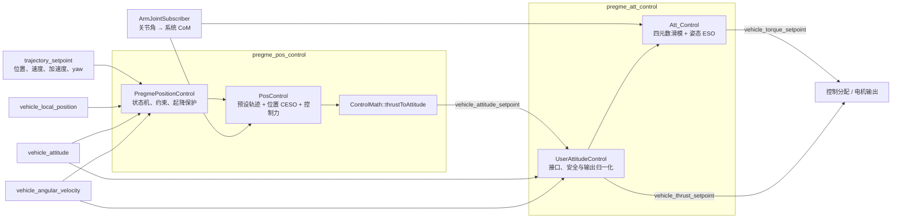

# PreGME 控制器概述

> **PreGME**（*Prescribed Performance Control of Aerial Manipulators based on Variable-Gain ESO*）是一套面向空中机械臂的预设性能运动控制框架，本项目将论文中的位置控制、姿态控制与变增益 ESO 工程化集成到 PX4 Autopilot，并额外加入机械臂质心（CoM）前馈补偿、起降保护、限幅与 uORB 接口适配等

## 阅读指南

- [理论框架与工程实现范围](#理论框架与工程实现范围)
- [空中机械臂系统建模](#空中机械臂系统建模)
- [变增益扩张状态观测器](#变增益扩张状态观测器)
- [预设性能与误差轨迹](#预设性能与误差轨迹)
- [PX4 控制架构](#px4-控制架构)
- [论文与源码的对应关系](#论文与源码的对应关系)
- [实现差异与工程约束](#实现差异与工程约束)
- [源码结构](#源码结构)
- [进一步阅读](#进一步阅读)

## 理论框架与工程实现范围

> PreGME 将多旋翼基座和机械臂视为可分别设计的子系统，并把二者之间难以精确建模的作用力和力矩作为扰动处理

| 控制层次 | 理论职责 | 工程实现 |
| :--- | :--- | :--- |
| 位置控制 | 生成控制力矢量，使位置误差跟随预设误差轨迹 | `pregme_pos_control` 模块<br>外层类：`PregmePositionControl`<br>核心算法类：`PosControl` |
| 姿态控制 | 生成控制力矩，使四元数向量误差跟随预设误差轨迹 | `pregme_att_control` 模块<br>外层类：`UserAttitudeControl`<br>核心算法类：`Att_Control` |
| 扰动估计 | 位置与姿态变增益 ESO 分别估计耦合力和耦合力矩 | 分别集成在位置控制环和姿态控制环中 |
| 已知耦合补偿 | 将显式模型补偿与扰动估计结合 | 根据系统 CoM 补偿向心加速度和重力矩 |
| 机械臂关节控制 | 跟踪期望关节角并输出关节力矩 | 不在 PX4 控制器内，由 Gazebo 或外部控制器完成 |

:::warning

本项目实现并非论文公式的逐行翻译，源码中还包含离散化、状态有效性检查、限幅、滤波、起降状态机以及 PX4 接口兼容等工程化逻辑

:::

## 空中机械臂系统建模

空中机械臂系统由多旋翼基座与机械臂组成，由于机械臂运动会引入额外的惯性耦合、质心变化以及反作用力矩，PreGME 将系统动力学表示为：

$$
\text{系统动力学}
=
\text{基座动力学}
+
\text{机械臂未知耦合扰动}
$$

其中，多旋翼基座作为主要控制对象；机械臂运动引起的难以精确建模项被统一视为未知扰动，并由扩张状态观测器（ESO）在线估计补偿

---

### 坐标系定义


---

### 状态变量与控制输入

| 类别 | 符号 / 定义 | 含义 |
| :--- | :---: | :--- |
| 位置状态 | `p, v ∈ R^3` | 基座在惯性系中的位置与线速度 |
| 姿态状态 | `R ∈ SO(3)` | 从机体系 `Σ_B` 到惯性系 `Σ_I` 的旋转矩阵 |
| 角速度 | `ω ∈ R^3` | 机体系角速度 |
| 质量参数 | `m_B, m_R` | 多旋翼基座与机械臂质量 |
| 惯性参数 | `I ∈ R^(3×3)` | 基座惯性矩阵 |
| 控制输入 | `T` | 四旋翼总推力 |
| 控制输入 | `τ` | 机体系控制力矩 |
| 扰动项 | `Δ_v, Δ_ω` | 机械臂运动引起的未知耦合扰动 |

---

### 基座动力学模型

基座动力学描述多旋翼平台在机械臂扰动作用下的位置和姿态演化过程

#### 平移动力学

$$
\begin{aligned}
\dot{p}
&=v \\
\\
\dot{v}
&=
-\frac{TRn}{m_B+m_R}
+gn
+\Delta_v
\end{aligned}
$$


| 类型 | 符号 | 含义 |
| :--- | :---: | :--- |
| 控制输入 | `T` | 四旋翼总推力 |
| 常量向量 | `n = [0, 0, 1]^T` | 机体系下的推力方向单位向量 |
| 质量参数 | `m_B` | 多旋翼基座质量 |
| 质量参数 | `m_R` | 机械臂质量 |
| 扰动项 | `Δ_v` | 机械臂运动引起的未知平动扰动 |

#### 转动动力学

基座姿态变化满足：

$$
\begin{aligned}
\dot{R}
&=
R[\omega]_\times
\\
\\
\dot{\omega}
&=
I^{-1}
(\tau-\omega\times I\omega)
+\Delta_\omega
\end{aligned}
$$

| 类型 | 符号 | 含义 |
| :--- | :---: | :--- |
| 惯性参数 | `I` | 基座惯性矩阵 |
| 控制输入 | `τ` | 机体系控制力矩 |
| 矩阵运算 | `[ω]_×` | 角速度对应的反对称矩阵 |
| 扰动项 | `Δ_ω` | 机械臂运动引起的未知角动力学扰动 |

#### 机械臂耦合扰动建模

机械臂运动会改变系统动力学，其影响主要包括：

- 基座角加速度耦合；
- 机械臂关节角加速度影响；
- 时变惯性耦合；
- 系统质心变化产生的附加项

由于上述量难以通过机载传感器实时准确获得，PreGME 不直接建立完整机械臂动力学模型，而是将剩余影响统一表示为：

$$
\Delta_v,\Delta_\omega
$$

即未知扰动项。

在工程实现中：

- 位置控制环中的 CESO 用于估计 $\Delta_v$；
- 姿态控制环中的 ESO 用于估计 $\Delta_\omega$

估计结果与显式 CoM 补偿项结合，实现对机械臂耦合影响的在线补偿。

#### 无机械臂退化情况

当系统不存在机械臂时：

$$
m_R=0,
\qquad
\Delta_v=0,
\qquad
\Delta_\omega=0
$$

此时的系统模型变化：

$$
\text{空中机械臂动力学}
\rightarrow
\text{标准四旋翼动力学}
$$

即 PreGME 控制框架可直接应用于普通四旋翼平台

:::tip

机械臂并未改变控制器基本结构，而是通过未知扰动项影响多旋翼基座动力学，算法核心思想是：

- 利用显式 CoM 模型补偿处理可计算耦合项；
- 利用 ESO 估计剩余未知扰动

:::

## 变增益扩张状态观测器

> PreGME 使用变增益扩张状态观测器（Variable-Gain ESO）估计空中机械臂系统中的未知扰动

对于空中机械臂系统：

- 机械臂引起的耦合力和耦合力矩难以精确建模；
- 部分动力学项无法通过机载传感器直接测量；
- 控制器需要在线估计未知扰动并进行补偿。

因此，PreGME 将未知动态统一扩展为观测状态，并通过 ESO 实时重构。

### 标量 ESO 结构

考虑简化系统：

$$
\dot{x}=\Delta+u
$$

其中：

| 类型 | 符号 | 含义 |
| :--- | :---: | :--- |
| 状态 | `x` | 被观测状态 |
| 输入 | `u` | 已知控制输入 |
| 扰动 | `Δ` | 未知扰动 |

引入辅助状态 $h$：

$$
e=x-h
$$

其中 $e$ 为观测误差。

变增益 ESO 定义为：

$$
\begin{aligned}
\dot{h}
&=
\frac{\alpha g(e)}{\varepsilon}
+u,
\\
\hat{\Delta}
&=
\frac{\alpha g(e)}{\varepsilon}.
\end{aligned}
$$

其中：

- $h$：状态估计值；
- $\hat{\Delta}$：扰动估计值；
- $\alpha$：观测器增益；
- $\varepsilon$：观测器时间尺度参数。

### 变增益函数

PreGME 不采用固定增益，而使用误差相关的非线性增益：

$$
g(e)=
\frac{\exp(e)+\exp(-e)}
{w\left[\exp(e)+\exp(-e)\right]+d}
e
$$

该函数根据误差大小自动调整有效增益。

其作用为：

| 误差条件 | 增益变化 | 结果 |
| :--- | :--- | :--- |
| 误差绝对值较大 | 提高有效增益 | 加快扰动重构速度 |
| 误差绝对值较小 | 降低有效增益 | 减少传感器噪声放大 |
| `ε` 减小 | 整体响应加快 | 同时提高噪声敏感性 |

因此，变增益 ESO 在响应速度和噪声鲁棒性之间取得折中。

---

### 源码参数对应关系

论文中的 ESO 参数与 PX4 实现参数并非完全一一对应：

| 理论参数 / 作用 | 姿态控制参数 | 位置控制参数 |
| :--- | :--- | :--- |
| `α`<br>观测器增益 | `USR_ESO_L_X/Y/Z` | `PREGME_EV1*`、`PREGME_EV2*` |
| `ε`<br>观测时间尺度 | `USR_ESO_EPSI` | `PREGME_EVEPS` |
| `w`<br>非线性增益调节 | `USR_ESO_C1` | `PREGME_EVC1` |
| `d`<br>非线性增益偏置 | `USR_ESO_C2` | `PREGME_EVC2` |

:::warning

源码中的 ESO 并非论文公式的直接复制,姿态控制采用接近论文形式的单级 ESO；位置控制由于输入状态不同，采用两级级联 CESO 结构，用于从位置误差中同时恢复速度信息和扰动估计

:::

详见：

- [位置控制详解](position-control.md)
- [姿态控制详解](attitude-control.md)

## 预设性能与误差轨迹

> PreGME 通过预设性能控制（Prescribed Performance Control, PPC）限制误差演化过程，使跟踪误差始终满足预先设计的性能边界

控制目标不是简单降低误差，而是约束：

- 初始阶段允许较大误差；
- 随时间逐渐收缩误差范围；
- 最终保持指定稳态精度

### 性能包络函数

误差允许范围由性能函数定义：

$$
\rho(t)
=
(\rho_0-\rho_\infty)e^{-lt}
+
\rho_\infty
$$

对应误差约束：

$$
-\rho(t)
<
e(t)
<
\rho(t)
$$

其中：

| 参数 | 数学作用 | 工程意义 |
| :---: | :--- | :--- |
| `ρ_0` | 初始误差边界 | 决定初始允许跟踪误差 |
| `ρ_∞` | 稳态误差边界 | 决定最终控制精度 |
| `l` | 包络收敛参数 | 控制误差边界的收缩速度 |

### 预设误差轨迹

为避免直接约束误差，PreGME 构造辅助误差轨迹：

$$
b
=
l\tilde{\xi}(0)
+
\dot{\tilde{\xi}}(0)
$$

每个轴对应的预设轨迹为：

$$
\beta_i(t)
=
\beta_i(0)e^{-lt}
+
\frac{b_i}{c_i}
(1-e^{-c_i t})e^{-lt}
$$

其中：

- $\beta_i(t)$：第 $i$ 个轴的预设误差轨迹；
- $\dot{\beta}_i(t)$：一阶导数；
- $\ddot{\beta}_i(t)$：二阶导数。

由于轨迹具有解析表达式，控制器无需对测量误差进行高阶数值微分。

源码中：

| 理论量 | 含义 | 源码变量 |
| :---: | :--- | :--- |
| `β` | 预设误差轨迹 | `ed` |
| `β_dot` | 预设误差轨迹一阶导数 | `ed_dot` |
| `β_ddot` | 预设误差轨迹二阶导数 | `ed_ddot` |

当轨迹设定值发生明显变化时，源码会重新初始化对应轴的预设误差轨迹。

### 误差变换与滑模变量

位置控制和姿态控制采用统一误差结构：

$$
z
=
\tilde{\xi}
-
k\beta
$$

滑模变量定义为：

$$
s
=
\dot z+\Lambda z
$$

其中：

| 参数 | 控制作用 | 工程意义 |
| :---: | :--- | :--- |
| `k` | 预设轨迹权重 | 控制预设轨迹补偿的参与程度 |
| `Λ` | 收敛矩阵 | 调节误差收敛速度 |
| `K` | 反馈增益 | 调节滑模变量的反馈强度 |

当：

$$
k=0
$$

时，控制器退化为不包含预设误差轨迹补偿的普通滑模控制结构。

---

:::tip

PreGME 的控制流程可以概括为：

$$
\text{预设性能约束}
+
\text{滑模误差整形}
+
\text{ESO扰动补偿}
$$

三者共同保证空中机械臂在未知扰动条件下仍保持指定跟踪性能

:::

## PX4 控制架构



### 级联数据流

1. `PregmePositionControl` 读取位置状态、轨迹设定值和飞行约束。
2. `PosControl` 计算归一化推力矢量 `_thr_sp`。
3. `ControlMath::thrustToAttitude()` 将推力方向和期望偏航转换为姿态四元数。
4. `UserAttitudeControl` 读取 `vehicle_attitude_setpoint`。
5. `Att_Control` 计算物理意义上的机体系力矩。
6. 模块使用 `USR_TAU_COE` 将力矩归一化并限制到 $[-1,1]$，再发布给控制分配。

### CoM 补偿

源码将可计算的 CoM 耦合与 ESO 残差估计分开处理：

位置环向心项：

$$
\Delta_{v,\mathrm{com}}
=
-R\left[\omega\times\left(\omega\times p_C^B\right)\right].
$$

姿态环重力矩项：

$$
\Delta_{\omega,\mathrm{com}}
=
I^{-1}
\left[
m_{\mathrm{total}}p_C^B\times\left(R^Tg_n\right)
\right].
$$

最终控制器使用

$$
\hat{\Delta}_{\mathrm{total}}
=
\hat{\Delta}_{\mathrm{ESO}}
+
\Delta_{\mathrm{com}}.
$$

> 这是一种**部分显式补偿**，并不等于完整机械臂耦合动力学。关节加速度、时变惯量等剩余项仍交给 ESO

## 实现差异与工程约束

### 位置 ESO 不是论文的直接离散化

论文使用可测速度构造单层位置 ESO；当前源码从位置输入构造两级观察器：

- 第一级由位置误差形成速度估计；
- 第二级由速度估计误差形成扰动估计。

因此，位置参数 `EV1*` 和 `EV2*` 不应直接等同于论文中的单个 $\alpha_v$。

### 位置扰动注入带固定保护

进入控制律前，位置扰动估计还会经过：

- 水平限幅：$\pm1.5\ \mathrm{m/s^2}$；
- 垂向限幅：$\pm2.0\ \mathrm{m/s^2}$；
- 1.5 Hz 低通；
- $0.03\ \mathrm{m/s^2}$ 软死区。

这些常量目前写死在 `PosControl.cpp`，没有 PX4 参数入口。

### 姿态 ESO 的补偿使用高度门限

当 PX4 NED 位置满足 `z < -1 m` 时，姿态控制律才使用 ESO 扰动估计；较低高度或位置无效时，本周期控制端将估计值置零。该门限是源码常量，不是参数。

### 姿态参考角速度被简化

论文允许完整的期望角速度 $\omega_d$ 及其导数。当前自动控制路径主要使用：

- 期望姿态四元数；
- 绕世界系 $z$ 轴的偏航角速度前馈。

滚转和俯仰参考角速度默认是零。

### 手动姿态生成路径当前被关闭

源码保留了手动姿态设定值和油门曲线生成代码，但 `manual_stabilized` 被固定为 `false`。当前正常路径始终读取上游发布的 `vehicle_attitude_setpoint`。

### 惯性矩阵为静态参数

`Att_Control` 从 `USR_I_*` 读取惯性矩阵并预计算逆矩阵，不进行在线惯性辨识。抓取载荷引起的变化由 CoM 补偿和 ESO 部分吸收。

## 源码结构

```text
src/
├── modules/
│   ├── pregme_pos_control/
│   │   ├── PregmePositionControl.{hpp,cpp}
│   │   ├── PosControl.{hpp,cpp}
│   │   ├── ControlMath.{hpp,cpp}
│   │   └── Takeoff.{hpp,cpp}
│   └── pregme_att_control/
│       ├── pregme_att_control.{hpp,cpp}
│       └── Att_control/Att_control.{hpp,cpp}
└── lib/
    └── gamma_arm_dynamics/
        ├── gamma_arm_dynamics.{hpp,cpp}
        └── ArmJointSubscriber.{hpp,cpp}
```

| 文件 | 类型 | 主要职责 |
| :--- | :--- | :--- |
| `PregmePositionControl.cpp` | 模块入口 | uORB 主循环、状态转换、参数更新、起降状态机、失效保护 |
| `PosControl.cpp` | 核心算法 | 位置预设轨迹、两级 CESO、CoM 向心补偿、推力计算与限幅 |
| `ControlMath.cpp` | 数学工具 | 推力方向到姿态四元数的转换、倾角限制及通用几何工具 |
| `pregme_att_control.cpp` | 模块入口 | 姿态模块主循环、输出归一化、解锁/落地/电池保护 |
| `Att_control.cpp` | 核心算法 | 四元数误差控制律、姿态 ESO、CoM 重力矩补偿 |
| `ArmJointSubscriber.cpp` | 数据接口 | 读取机械臂关节角并缓存系统 CoM 与总质量 |

## 进一步阅读

- [位置控制详解](position-control.md)
- [姿态控制详解](attitude-control.md)
- [参数参考与整定指南](parameters.md)
- [PreGME 理论论文](/references/pregme-paper.pdf)
- [平台物理参数参考](/references/pregme-parameter-reference.pdf)
