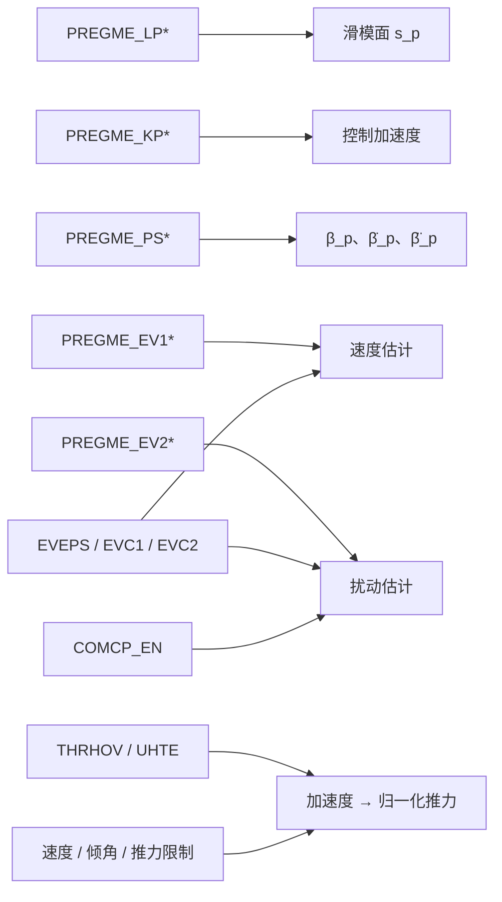

# PreGME 参数参考与整定指南

本页以所提供的中文/英文 PX4 参数 YAML 和控制器源码为依据，列出全部 PreGME 参数，并标记其在**当前自动控制路径**中的实际作用。

## 页面导航

- [使用前必须确认的差异](#使用前必须确认的差异)
- [整定总原则](#整定总原则)
- [位置控制参数](#位置控制参数)
- [姿态控制参数](#姿态控制参数)
- [平台物理参数](#平台物理参数)
- [推荐整定流程](#推荐整定流程)
- [不可参数化的源码常量](#不可参数化的源码常量)

---

## 使用前必须确认的差异

### 双语 YAML 默认值不一致

| 参数 | 中文 YAML | 英文 YAML | 影响 |
| :--- | :---: | :---: | :--- |
| `PREGME_PSK` | 0 | 1 | 0 会关闭大部分位置预设轨迹补偿；1 会完整启用 |
| `USR_TAU_COE` 最大值 | 150 | 40 | 影响地面站可设置范围，但不改变默认值 8 |

构建前应统一两份 YAML，避免不同构建配置或后续维护产生不可预测的默认值。

### 惯性参数参考与 YAML 默认值不一致

平台物理参数参考给出的整机惯量为：

$$
I_{\mathrm{ref}}
=
\operatorname{diag}
\left(
0.4485,\ 0.2365,\ 0.6788
\right).
$$

姿态参数 YAML 默认值为：

$$
I_{\mathrm{yaml}}
=
\operatorname{diag}
\left(
0.20,\ 0.19,\ 0.33
\right).
$$

两者差异明显。应根据**控制对象在 PX4 中实际定义的刚体边界**确定使用哪组惯量：

- 若控制律中的 $I$ 表示完整飞行平台，应使用整机惯量；
- 若模型已将旋翼、电机或其他部件拆成独立链接，需确认控制器是否仍应使用合并惯量；
- 不应仅因为仿真 SDF 能运行，就认为 `USR_I_*` 已正确。

### 参数存在不代表当前路径会使用

当前姿态模块将 `manual_stabilized` 固定为 `false`，因此手动姿态和手动油门相关参数不会进入正常自动控制路径。

位置模块中的部分速度、加速度和 jerk 参数主要用于响应性预设或兼容 PX4 参数体系，当前 `PosControl` 核心控制律没有直接读取它们。

---

## 整定总原则

### 先模型，后控制

优先确认：

- 质量、重心和惯性矩阵；
- 悬停推力；
- 电机方向、推力常数和力矩常数；
- NED 坐标方向；
- 关节角到 CoM 的运动学结果。

模型错误无法通过无限提高控制增益修复。

### 先反馈，后观测器

推荐顺序：

1. 关闭预设轨迹补偿；
2. 关闭 CoM 补偿；
3. 将 ESO 增益设为零或非常小；
4. 调整基础位置/姿态反馈；
5. 启用 ESO；
6. 启用预设轨迹；
7. 最后启用 CoM 补偿并做机械臂动态测试。

### 一次只调整一个作用链

- $\Lambda$：误差面收敛速度；
- $K$：反馈与抗扰强度；
- ESO：扰动估计带宽；
- preset：期望误差瞬态；
- limits：执行器和安全边界。

同时大幅修改多个组会使日志无法解释。

---

## 位置控制参数


### 位置控制增益

| 参数 | 默认值 | 范围 | 单位 | 当前作用 | 说明 |
| :--- | :---: | :---: | :---: | :---: | :--- |
| `PREGME_LPX` | 1.6 | 0 ～ 5 | — | 核心生效 | X 轴位置外环滑模面中的 lambda_p 对角增益。代码中用于 slide_mode = zp_dot + lambda_p * zp；数值越大，X 方向位置误差收敛越快，但会带来更大的加速度和推力需求。 |
| `PREGME_LPY` | 1.6 | 0 ～ 5 | — | 核心生效 | Y 轴位置外环滑模面中的 lambda_p 对角增益。数值越大，横向误差修正越积极，但过大可能导致横向振荡或姿态响应变急。 |
| `PREGME_LPZ` | 2.4 | 0 ～ 5 | — | 核心生效 | Z 轴高度通道的 lambda_p 对角增益，用于塑造高度误差收敛速度。数值越大，高度修正更强，但垂向推力变化也会更敏感。 |
| `PREGME_KPX` | 1.8 | 0 ～ 5 | — | 核心生效 | 作用在 X 轴滑模变量上的 Kp 增益，参与 f_iusl 计算。数值越大，水平纠偏加速度越强；过大可能触发姿态和推力饱和，飞控又要开始表演杂技。 |
| `PREGME_KPY` | 1.8 | 0 ～ 5 | — | 核心生效 | 作用在 Y 轴滑模变量上的 Kp 增益，增强横向位置纠偏能力。应结合 PREGME_LPY、水平速度限制和推力限制一起调。 |
| `PREGME_KPZ` | 1.6 | 0 ～ 5 | — | 核心生效 | 作用在垂向滑模变量上的 Kp 增益，直接影响高度通道推力需求；代码中还会用它生成起飞斜坡的初始相关量。 |


### 位置 CESO

| 参数 | 默认值 | 范围 | 单位 | 当前作用 | 说明 |
| :--- | :---: | :---: | :---: | :---: | :--- |
| `PREGME_EV1X` | 0.01 | 0 ～ 5 | — | 核心生效 | X 轴位置 CESO 的第一层观测增益，作用于位置估计误差，影响速度估计。数值越大，跟踪越快，但对位置噪声也更敏感。 |
| `PREGME_EV1Y` | 0.01 | 0 ～ 5 | — | 核心生效 | Y 轴位置 CESO 的第一层观测增益，影响横向速度估计。定位数据噪声较大时不要盲目加大，飞控不是滤波器许愿机。 |
| `PREGME_EV1Z` | 0.01 | 0 ～ 5 | — | 核心生效 | Z 轴位置 CESO 的第一层观测增益，影响高度相关速度估计。过大可能让垂向扰动估计变噪，表现为高度/油门更躁动。 |
| `PREGME_EV2X` | 0.008 | 0 ～ 5 | — | 核心生效 | X 轴 CESO 第二层观测增益，作用于速度估计误差，并生成扰动估计 delta_est。数值越大，抗扰更强，但也可能注入噪声。 |
| `PREGME_EV2Y` | 0.01 | 0 ～ 5 | — | 核心生效 | Y 轴 CESO 第二层观测增益，用于形成横向扰动估计。应和 EV1Y 配合调节，避免横向加速度抖动。 |
| `PREGME_EV2Z` | 0.01 | 0 ～ 5 | — | 核心生效 | Z 轴 CESO 第二层观测增益。代码中 Z 向原始扰动估计不会直接进推力，而是先限幅、低通和死区处理，以避免 OFFBOARD 悬停时油门抽动。 |
| `PREGME_EVEPS` | 1 | 0 ～ 40 | — | 核心生效 | CESO 缩放参数。观测器修正项会除以 epsilon，所以越小代表观测器越快、越强。代码对接近 0 的值做了保护，但过小仍可能放大噪声。 |
| `PREGME_EVC1` | 0.3 | 0 ～ 5 | — | 核心生效 | 非线性 CESO 函数分母中的形状系数。c1 越大，大误差下的等效观测增益越低，修正更柔和。 |
| `PREGME_EVC2` | 0.5 | 0 ～ 5 | — | 核心生效 | 非线性 CESO 函数分母中的偏置系数。c2 越大，小信号观测增益越低，扰动估计更平滑但响应更慢。 |


### 位置预设轨迹

| 参数 | 默认值 | 范围 | 单位 | 当前作用 | 说明 |
| :--- | :---: | :---: | :---: | :---: | :--- |
| `PREGME_PSL` | 1 | 0 ～ 20 | — | 核心生效 | 预设性能轨迹参数 l，控制位置设定值变化后误差包络的衰减速度。数值越大，瞬态目标衰减越快，控制更积极。 |
| `PREGME_PSW` | 0.1 | 0 ～ 1 | — | 核心生效 | 预设性能轨迹参数 w，用于缩放初始位置误差和速度误差，进而生成 ed、ed_dot、ed_ddot。 |
| `PREGME_PSEPS` | 0.05 | 0 ～ 1 | — | 核心生效 | 用于判断位置设定值是否发生明显变化并刷新预设轨迹，同时也加入内部 c 系数，避免奇异问题。 |
| `PREGME_PSK` | 中文 0 / 英文 1 | 0 ～ 1 | — | 核心生效 | 预设轨迹补偿耦合系数。代码中使用 zp = pos_err - k * ed、zp_dot = vel_err - k * ed_dot；k=0 基本相当于关闭大部分预设瞬态补偿。 |


### 推力、速度与倾角

| 参数 | 默认值 | 范围 | 单位 | 当前作用 | 说明 |
| :--- | :---: | :---: | :---: | :---: | :--- |
| `PREGME_THRMIN` | 0.4 | 0 ～ 0.95 | — | 核心生效 | 飞行状态下使用的归一化最小推力限制。未起飞或无起飞请求的地面接触状态下，控制器允许推力降为 0，避免落地后还硬顶油门。 |
| `PREGME_THRHOV` | 0.68 | 0.1 ～ 0.8 | — | 核心生效 | 悬停所需的名义归一化推力。起飞前一定使用该固定值；关闭悬停推力估计或估计尚未初始化时，也使用该值。 |
| `PREGME_UHTE` | `true` | — | — | 开关生效 | 是否使用 hover_thrust_estimate。注意：只有已经进入飞行状态且未 landed/ground_contact 时才会使用；起飞前仍强制使用 PREGME_THRHOV，保证起飞过程确定。 |
| `PREGME_THRMAX` | 0.95 | 0 ～ 0.95 | — | 核心生效 | 位置控制器的归一化最大推力上限。它限制垂向推力，也会决定还能分配给水平推力向量的余量。 |
| `PREGME_ZVUP` | 1 | 0.5 ～ 8 | m/s | 核心生效 | 垂向向上速度限制，也用于起飞斜坡输出的速度上限。起飞速度 PREGME_TKOSPD 不会超过该值。 |
| `PREGME_ZVDN` | 0.75 | 0.5 ～ 4 | m/s | 核心生效 | 垂向下降速度限制，用于下降、着陆和 failsafe 降落逻辑。 |
| `PREGME_XYVMAX` | 20 | 2 ～ 20 | m/s | 核心生效 | 位置内环真正使用的总体水平速度上限。X/Y 速度设定值会被限制在 +/- 该数值范围内。 |
| `PREGME_TILTAIR` | 45 | 20 ～ 89 | deg | 核心生效 | 飞行状态下的最大倾角限制，单位为度。代码中经过斜率限制后设置给控制器，并受内部 MAX_SAFE_TILT_DEG 安全上限约束。 |
| `PREGME_TILTLND` | 12 | 10 ～ 89 | deg | 核心生效 | 起飞状态进入 flight 前以及着陆相关状态使用的倾角限制。该值不能大于 PREGME_TILTAIR。 |
| `PREGME_LANDSPD` | 0.5 | ≥ 0.4 | m/s | 核心生效 | 着陆和 failsafe 下降时的名义下降速度。参数更新时会被限制不超过 PREGME_ZVDN，也可由 PREGME_ZVALL 自动设置。 |
| `PREGME_TKOSPD` | 0.6 | 0.6 ～ 5 | m/s | 核心生效 | 起飞过程请求的名义爬升速度。它会被 PREGME_ZVUP 限制，并进入起飞斜坡，使上升速度限制平滑增大。 |
| `PREGME_VELD_LP` | 5 | 0 ～ 15 | Hz | 核心生效 | 由局部速度数值微分估计加速度时使用的低通截止频率。0 或负值表示不过滤，直接使用原始微分；数值越高延迟越小但加速度更吵。 |


### 起飞与耦合补偿

| 参数 | 默认值 | 范围 | 单位 | 当前作用 | 说明 |
| :--- | :---: | :---: | :---: | :---: | :--- |
| `PREGME_TKORAMP` | 3 | 0 ～ 5 | — | 核心生效 | 起飞状态机将向上速度限制从 0 平滑增加到目标起飞速度所用的时间。数值越大起飞越柔；为 0 时基本取消斜坡。 |
| `PREGME_SPUPTIME` | 1 | 0 ～ 10 | s | 核心生效 | 解锁后从 spoolup 进入 ready_for_takeoff 前的强制等待时间，防止电机尚未预旋完成就立即执行起飞。 |
| `PREGME_COMCP_EN` | `true` | — | — | 开关生效 | 启用机械臂质心耦合补偿。启用后，位置控制器会根据机械臂质心偏移计算向心加速度补偿，并叠加到 ESO 扰动估计中。关闭后不进行机械臂耦合补偿。 |


### 响应性和兼容参数

| 参数 | 默认值 | 范围 | 单位 | 当前作用 | 说明 |
| :--- | :---: | :---: | :---: | :---: | :--- |
| `PREGME_XYCRS` | 10 | 2 ～ 20 | m/s | 仅约束/批量设置 | 自主/任务类水平巡航速度参数，会被限制不超过 PREGME_XYVMAX。当前模块中主要作为 PX4 风格参数兼容项保留。 |
| `PREGME_VMAN` | 10 | 2 ～ 20 | m/s | 仅约束/批量设置 | 手动模式水平速度限制参数，会被限制不超过 PREGME_XYVMAX。当前模块中主要受 XY 一键速度设置和响应性参数影响。 |
| `PREGME_MYMAX` | 150 | 0 ～ 400 | deg/s | 仅由响应性预设写入 | 保留给 PX4 风格响应性调节的手动偏航角速度参数。当前位置控制内环不直接使用它，但 PREGME_VRESP 会自动改写它。 |
| `PREGME_MYTAU` | 0.08 | 0 ～ 5 | s | 仅由响应性预设写入 | 手动偏航角速度输入滤波时间常数，主要作为 PX4 风格调参兼容项。PREGME_VRESP 增大时会把它逐渐推向 0，让响应更直接。 |
| `PREGME_AHMAX` | 5 | 2 ～ 15 | m/s^2 | 仅由响应性预设写入 | 水平运动加速度兼容参数，会被 PREGME_VRESP 自动更新。当前 PosControl 内部并没有把它作为硬加速度限幅直接使用。 |
| `PREGME_AHOR` | 3 | 2 ～ 15 | m/s^2 | 仅由响应性预设写入 | 自动/手动运动整形用的兼容加速度参数，会被 PREGME_VRESP 自动更新。若要确认其是否影响轨迹生成，需要检查上游 trajectory generator。 |
| `PREGME_AUPMAX` | 4 | 2 ～ 15 | m/s^2 | 仅由响应性预设写入 | 垂向上升加速度兼容参数，会被 PREGME_VRESP 自动更新。当前模块主要通过速度、推力和起飞斜坡限制垂向运动。 |
| `PREGME_ADNMAX` | 3 | 2 ～ 15 | m/s^2 | 仅由响应性预设写入 | 垂向下降加速度兼容参数，会被 PREGME_VRESP 自动更新。当前控制器更主要依赖下降速度和推力限制保证垂向安全。 |
| `PREGME_JMAX` | 8 | 0.5 ～ 500 | m/s^3 | 仅由响应性预设写入 | 运动平滑用 jerk 兼容参数。一般来说数值越小轨迹越平滑；当前模块主要通过 PREGME_VRESP 对它进行联动改写。 |
| `PREGME_JAUTO` | 4 | 1 ～ 80 | m/s^3 | 仅由响应性预设写入 | 自主运动 jerk 兼容参数，会被 PREGME_VRESP 自动更新，主要用于 PX4 风格轨迹调参，而不是 PosControl 反馈律里的直接项。 |
| `PREGME_VRESP` | -1 | -1 ～ 1 | — | 参数预设器 | 全局调参快捷入口。设置为非负值时，代码会用它的平方自动改写多项加速度、jerk、偏航和倾角参数。想单独调这些参数，就把它设回 -1。 |
| `PREGME_XYVALL` | -1 | -1 ～ 20 | m/s | 一次性批量设置 | 一次性辅助参数。设为非负值后，会把该值一次性复制到 PREGME_VMAN、PREGME_XYCRS 和 PREGME_XYVMAX，然后控制器自动把本参数重置为 -1。 |
| `PREGME_ZVALL` | -1 | -1 ～ 10 | m/s | 一次性批量设置 | 一次性辅助参数。设为非负值后，会派生设置 PREGME_ZVUP、PREGME_ZVDN、PREGME_TKOSPD 和 PREGME_LANDSPD，然后控制器自动把本参数重置为 -1。 |


### 位置参数的实际依赖关系



### 响应性预设的具体行为

当 `PREGME_VRESP >= 0` 时，源码先计算

$$
r=\texttt{PREGME\_VRESP}^2
$$

再自动写入水平加速度、最大加速度、偏航响应、倾角、垂向加速度和 jerk 参数。它不会直接修改 PreGME 的 $\Lambda_p$、$K_p$ 或 ESO 参数。

`PREGME_XYVALL` 和 `PREGME_ZVALL` 是一次性命令参数：

- 应用到相关速度参数；
- 写入后自动恢复为 `-1`；
- 不适合作为持续状态变量使用。

---

## 姿态控制参数


### 惯性矩阵

| 参数 | 默认值 | 范围 | 单位 | 当前作用 | 说明 |
| :--- | :---: | :---: | :---: | :---: | :--- |
| `USR_I_XX` | 0.2 | 0 ～ 20 | — | 核心生效 | 机体绕滚转轴的主转动惯量 [kg m^2]。控制器会把它放入惯量矩阵，用于力矩计算和陀螺耦合补偿。该值应来自实测或估算的质量特性，填错会影响力矩前馈与补偿效果。 |
| `USR_I_YY` | 0.19 | 0 ～ 20 | — | 核心生效 | 机体绕俯仰轴的主转动惯量 [kg m^2]。控制器会把它放入惯量矩阵，用于力矩计算和陀螺耦合补偿。该值应来自实测或估算的质量特性，填错会影响力矩前馈与补偿效果。 |
| `USR_I_ZZ` | 0.33 | 0 ～ 20 | — | 核心生效 | 机体绕偏航轴的主转动惯量 [kg m^2]。控制器会把它放入惯量矩阵，用于力矩计算和陀螺耦合补偿。该值应来自实测或估算的质量特性，填错会影响力矩前馈与补偿效果。 |
| `USR_I_XY` | 0 | 0 ～ 20 | — | 核心生效 | 机体系 X 与 Y 轴之间的惯性积 [kg m^2]。代码构造惯量矩阵时会在非对角位置使用 -Ixy。对称多旋翼通常接近 0，除非有明确的质量特性测量数据，否则不建议随意增大。 |
| `USR_I_XZ` | 0 | 0 ～ 20 | — | 核心生效 | 机体系 X 与 Z 轴之间的惯性积 [kg m^2]。代码构造惯量矩阵时会在非对角位置使用 -Ixz。对称多旋翼通常接近 0，除非有明确的质量特性测量数据，否则不建议随意增大。 |
| `USR_I_YZ` | 0 | 0 ～ 20 | — | 核心生效 | 机体系 Y 与 Z 轴之间的惯性积 [kg m^2]。代码构造惯量矩阵时会在非对角位置使用 -Iyz。对称多旋翼通常接近 0，除非有明确的质量特性测量数据，否则不建议随意增大。 |


### 姿态控制增益

| 参数 | 默认值 | 范围 | 单位 | 当前作用 | 说明 |
| :--- | :---: | :---: | :---: | :---: | :--- |
| `USR_LAMBDA_Q_X` | 20 | 0 ～ 60 | — | 核心生效 | 滚转轴四元数向量误差滑模面的 lambda 增益。数值越大，姿态误差收敛越快，但所需力矩也会增大；如果角速度环、惯量参数或执行器能力不匹配，容易诱发振荡。 |
| `USR_LAMBDA_Q_Y` | 18 | 0 ～ 40 | — | 核心生效 | 俯仰轴四元数向量误差滑模面的 lambda 增益。数值越大，姿态误差收敛越快，但所需力矩也会增大；如果角速度环、惯量参数或执行器能力不匹配，容易诱发振荡。 |
| `USR_LAMBDA_Q_Z` | 20 | 0 ～ 40 | — | 核心生效 | 偏航轴四元数向量误差滑模面的 lambda 增益。数值越大，偏航误差收敛越快；但多旋翼偏航控制力矩通常弱于滚转和俯仰，所以增大时要更谨慎。 |
| `USR_K_Q_X` | 7.8 | 0 ～ 30 | — | 核心生效 | 作用在滚转轴滑模面上的反馈增益。增大后抗扰和跟踪刚度更强，但过大会带来高频力矩命令、振动或执行器饱和。 |
| `USR_K_Q_Y` | 8.6 | 0 ～ 30 | — | 核心生效 | 作用在俯仰轴滑模面上的反馈增益。增大后抗扰和跟踪刚度更强，但过大会带来高频力矩命令、振动或执行器饱和。 |
| `USR_K_Q_Z` | 12 | 0 ～ 30 | — | 核心生效 | 作用在偏航轴滑模面上的反馈增益。由于多旋翼偏航控制能力一般较弱，增大该参数时需要比滚转、俯仰更保守。 |


### 姿态 ESO

| 参数 | 默认值 | 范围 | 单位 | 当前作用 | 说明 |
| :--- | :---: | :---: | :---: | :---: | :--- |
| `USR_ESO_L_X` | 0.2 | 0 ～ 50 | — | 核心生效 | 滚转轴扩张状态观测器的非线性增益 L。它决定观测器修正量和扰动估计强度。数值越大，对模型误差或外扰反应越快，但也会放大陀螺仪噪声和振动。 |
| `USR_ESO_L_Y` | 0.2 | 0 ～ 50 | — | 核心生效 | 俯仰轴扩张状态观测器的非线性增益 L。它决定观测器修正量和扰动估计强度。数值越大，对模型误差或外扰反应越快，但也会放大陀螺仪噪声和振动。 |
| `USR_ESO_L_Z` | 0.5 | 0 ～ 50 | — | 核心生效 | 偏航轴扩张状态观测器的非线性增益 L。它决定观测器修正量和扰动估计强度。数值越大，对模型误差或外扰反应越快，但也会放大陀螺仪噪声和振动。 |
| `USR_ESO_EPSI` | 1 | 0 ～ 20 | — | 核心生效 | 扩张状态观测器的时间尺度分母。数值越小，观测器越快、越激进；过小会放大噪声并增加数值敏感性。代码内部会把它限制到安全的正下限。 |
| `USR_ESO_C1` | 0.3 | 0 ～ 50 | — | 核心生效 | 非线性 ESO 修正函数中的形状参数 c1，用于改变修正量随误差增大的变化方式。数值越大，大误差下的修正会更柔和；过小会让观测器过于激进。 |
| `USR_ESO_C2` | 0.5 | 0 ～ 50 | — | 核心生效 | 非线性 ESO 修正函数中的偏置参数 c2，用于避免分母过小，并影响小误差附近的敏感度。数值越大，观测器修正强度越弱。 |


### 姿态预设轨迹

| 参数 | 默认值 | 范围 | 单位 | 当前作用 | 说明 |
| :--- | :---: | :---: | :---: | :---: | :--- |
| `USR_A_PRESET_L` | 1 | 0 ～ 20 | — | 核心生效 | 姿态误差预设轨迹中的衰减率参数 l。数值越大，设定值变化后的参考误差衰减越快，响应速度可能提高，但瞬态力矩需求也会变大。 |
| `USR_A_PRESET_W` | 0.1 | 0 ～ 1 | — | 核心生效 | 预设轨迹中的初始误差缩放参数 w。用于缩放初始姿态误差和误差变化率，生成过渡整形轨迹。 |
| `USR_A_PRESET_EP` | 0.05 | 0 ～ 0.5 | — | 核心生效 | 四元数向量设定值变化阈值 epsilon。当设定值变化超过该阈值时，预设轨迹计时会重置。阈值越小，越容易因很小的设定值变化触发重置；过小可能受数值噪声影响。 |
| `USR_A_PRESET_K` | 1 | 0 ～ 1 | — | 核心生效 | 预设轨迹参与姿态误差整形前的增益 k。数值越大，控制器越强地跟随该瞬态整形项。 |


### 力矩归一化与角速度

| 参数 | 默认值 | 范围 | 单位 | 当前作用 | 说明 |
| :--- | :---: | :---: | :---: | :---: | :--- |
| `USR_TAU_COE` | 8 | 6 ～ 150 | — | 核心生效 | 用于把控制器计算出的力矩命令转换为 PX4 归一化力矩设定值。发布前执行 torque / USR_TAU_COE，然后限制在 [-1, 1]。数值越大，归一化力矩输出越小；数值越小，输出越强，也越容易饱和。 |
| `USR_ROLLRATE_MAX` | 220 | 0 ～ 1800 | deg/s | 当前自动路径通常无作用 | 姿态控制器使用的最大滚转体轴角速度设定值 [deg/s]。代码内部会转换为 rad/s。主要限制手动/增稳姿态行为中生成的滚转角速度参考，也用于兼容日志状态。 |
| `USR_PITRATE_MAX` | 220 | 0 ～ 1800 | deg/s | 当前自动路径通常无作用 | 姿态控制器使用的最大俯仰体轴角速度设定值 [deg/s]。代码内部会转换为 rad/s。主要限制手动/增稳姿态行为中生成的俯仰角速度参考，也用于兼容日志状态。 |
| `USR_YAWRATE_MAX` | 200 | 0 ～ 1800 | deg/s | 限制偏航前馈 | 姿态控制器使用的最大偏航体轴角速度设定值 [deg/s]。代码内部会转换为 rad/s，用于限制生成的偏航角速度参考。 |


### 手动姿态兼容参数

| 参数 | 默认值 | 范围 | 单位 | 当前作用 | 说明 |
| :--- | :---: | :---: | :---: | :---: | :--- |
| `USR_MAN_Y_MAX` | 150 | 0 ～ 360 | deg/s | 当前自动路径未使用 | 增稳模式下，手动偏航杆量可指令的最大偏航角速度 [deg/s]。摇杆输入会乘以该值，再积分形成偏航姿态设定值。 |
| `USR_MAN_TILT_TAU` | 0 | 0 ～ 2 | s | 当前自动路径未使用 | 手动滚转、俯仰摇杆输入的一阶滤波时间常数 [s]。设为 0 表示不滤波。数值越大，摇杆响应越平滑，但也越慢。 |
| `USR_MAN_TILT_MAX` | 35 | 0 ～ 90 | deg | 当前自动路径未使用 | 增稳模式下手动摇杆可生成的最大滚转/俯仰倾斜角 [deg]。该参数限制姿态设定值幅度，然后再生成四元数设定值。 |
| `USR_MANTHR_MIN` | 0.08 | 0 ～ 0.95 | — | 当前自动路径未使用 | 增稳/手动油门映射中，飞机未落地时使用的最小归一化推力。落地状态下，代码会出于安全考虑把有效最小值强制为 0。 |
| `USR_THR_MAX` | 0.95 | 0 ～ 0.95 | — | 当前自动路径未使用 | 增稳/手动油门映射中使用的最大归一化推力。最终推力命令会限制在 0 到该值之间。 |
| `USR_THR_HOVER` | 0.68 | 0 ～ 0.95 | — | 当前自动路径未使用 | 悬停对应的归一化推力。默认油门曲线下，油门杆居中会映射到该值。 |
| `USR_THR_CURVE` | 0 | 0 ～ 1 | — | 当前自动路径未使用 | 手动油门映射模式。0：带悬停点重映射，油门杆居中对应 USR_THR_HOVER。1：线性映射，将摇杆范围 [-1, 1] 直接映射到 [最小推力, USR_THR_MAX]，不进行悬停推力重映射。 |
| `USR_AIRMODE` | 0 | 0 ～ 2 | — | 当前自动路径未使用 | 手动姿态设定值逻辑使用的 Airmode 选择。0：默认行为。2：即使低油门也保持偏航设定值积分，相当于 roll-pitch-yaw airmode 行为。 |


### 安全与补偿

| 参数 | 默认值 | 范围 | 单位 | 当前作用 | 说明 |
| :--- | :---: | :---: | :---: | :---: | :--- |
| `USR_BAT_SCALE_EN` | `true` | — | — | 条件生效 | 启用 battery_status.scale 补偿。启用后，如果电池缩放系数有效，归一化力矩和推力设定值会乘以该系数，用于补偿电池电压下降。 |
| `USR_COM_COMP_EN` | `true` | — | — | 开关生效 | 启用机械臂质心耦合补偿。启用后，姿态控制器会根据机械臂质心偏移计算重力矩补偿，并叠加到 ESO 扰动估计中。关闭后不进行机械臂耦合补偿。 |
| `CBRK_RATE_CTRL` | 0 | — | — | 安全断路器 | 该自定义角速度控制输出路径的断路器。设置为代码期望的断路器键值时，模块会在发布有效 vehicle_torque_setpoint 和 vehicle_thrust_setpoint 前直接返回。正常飞行请保持为 0。 |


### 惯性矩阵的符号约定

源码构造

$$
I=
\begin{bmatrix}
I_{xx} & -I_{xy} & -I_{xz}\\
-I_{xy} & I_{yy} & -I_{yz}\\
-I_{xz} & -I_{yz} & I_{zz}
\end{bmatrix}.
$$

这意味着 `USR_I_XY/XZ/YZ` 在参数中按惯性积的正值填写，源码内部再写入负号。若直接从 SDF/URDF 的矩阵元素复制，应先确认文件使用的是矩阵元素还是惯性积定义，避免重复取负。

### 力矩归一化

`USR_TAU_COE` 的作用为

$$
\tau_{\mathrm{pub}}
=
\operatorname{sat}_{[-1,1]}
\left(
\frac{\tau_{\mathrm{control}}}{\texttt{USR\_TAU\_COE}}
\right).
$$

它与控制增益共同决定输出尺度。调节建议：

- 物理力矩合理但发布值过小：减小 `USR_TAU_COE`；
- 发布值频繁达到 $\pm1$：增大 `USR_TAU_COE` 或降低控制增益；
- 修改后必须重新检查控制分配和电机饱和。

### 当前自动路径中的角速度限制

源码只根据偏航速率前馈构造 $\omega_r$。因此：

- `USR_YAWRATE_MAX` 会限制偏航前馈；
- `USR_ROLLRATE_MAX`、`USR_PITRATE_MAX` 在当前自动路径中通常不会限制非零参考；
- 三个参数仍会在未来启用手动路径或增加完整角速度前馈时发挥作用。

---

## 平台物理参数

所提供的物理参数参考主要描述 Gazebo 电机插件和黑天鹅平台惯性建模。这些参数不属于 `PREGME_*` 或 `USR_*` PX4 参数，但会直接影响仿真与控制器整定。

### Gazebo 电机模型

`gz::sim::systems::MulticopterMotorModel` 使用：

$$
F=k_F\omega^2,
\qquad
\tau=k_MF.
$$

参考文档给出的 46 cm 螺旋桨估计值：

| SDF 参数 | 建议起始值 | 说明 |
| :--- | :---: | :--- |
| `motorConstant` | `8.1e-05` | 推力系数 $k_F$ |
| `momentConstant` | `0.021` | 反扭矩与推力比 $k_M$ |
| `maxRotVelocity` | `750 rad/s` | 约 7160 RPM，需结合 ESC/试飞验证 |
| `timeConstantUp` | `0.02 s` | 升速时间常数 |
| `timeConstantDown` | `0.03 s` | 降速时间常数 |
| `rotorDragCoefficient` | `0.00018` | 前飞水平阻尼估计 |
| `rollingMomentCoefficient` | `1e-06` | 滚转力矩系数起始值 |
| `rotorVelocitySlowdownSim` | `10` | 主要影响可视化转速 |

### 质量与惯量参考

| 对象 | 质量 | CoM | 惯量 |
| :--- | :---: | :--- | :--- |
| `base_link`（剥离电机） | 7.8874 kg | $(-0.0751,0,-0.0322)$ m | $(0.3655,0.1895,0.5488)$ kg·m² |
| 单个电机/桨链接 | 0.130 kg | $(0,0,-0.04471)$ m | $(0.0002,0.0002,0.000355)$ kg·m² |
| 完整飞行平台参考 | 8.4074 kg | 约 $(-0.0700,0,-0.0338)$ m | $(0.4485,0.2365,0.6788)$ kg·m² |

> `USR_I_*` 应与控制器所代表的完整受控刚体相匹配，而不是机械地复制某一个链接的 SDF 惯量。

---

## 推荐整定流程

### 阶段 A：静态模型检查

- 确认悬停油门与总质量匹配；
- 逐轴施加小力矩，确认角加速度方向；
- 检查 `USR_I_*` 数量级；
- 机械臂关节静止时检查 CoM；
- 禁用电池缩放，建立可重复基线。

### 阶段 B：姿态基线

建议起点：

```text
USR_A_PRESET_K  = 0
USR_COM_COMP_EN = false
USR_ESO_L_X/Y/Z = 0
```

依次调整：

1. `USR_TAU_COE`
2. `USR_LAMBDA_Q_*`
3. `USR_K_Q_*`

目标是无机械臂运动时姿态快速、无持续振荡且力矩不长期饱和。

### 阶段 C：位置基线

建议起点：

```text
PREGME_PSK      = 0
PREGME_COMCP_EN = false
PREGME_EV1*     = small
PREGME_EV2*     = 0
```

依次调整：

1. `PREGME_THRHOV`
2. `PREGME_LP*`
3. `PREGME_KP*`
4. 速度、倾角和推力限制

### 阶段 D：ESO

- 先提高每轴 `L`；
- 再逐步减小 `EPSI`；
- 使用 `C2` 抑制小误差噪声；
- 姿态 ESO 在 1 m 以下不会进入控制律；
- 位置 ESO 注入受固定低通、死区和限幅保护。

### 阶段 E：预设轨迹

- 将 `*_PRESET_K` / `PREGME_PSK` 从 0 缓慢提高；
- 用 `L` 设定任务收敛时间；
- 用 `W` 控制初始轨迹幅值；
- 用 `EP/EPS` 控制设定值刷新灵敏度。

### 阶段 F：机械臂耦合

- 先静态改变机械臂姿态，验证 CoM 补偿方向；
- 再做低速关节运动；
- 最后做高速、大幅运动；
- 对比开启/关闭 CoM 和 ESO 的日志，区分模型补偿与残差估计贡献。

---

## 不可参数化的源码常量

### 位置控制

| 常量 | 数值 | 影响 |
| :--- | :---: | :--- |
| XY 扰动注入限幅 | 1.5 m/s² | 限制水平 CESO/CoM 补偿 |
| Z 扰动注入限幅 | 2.0 m/s² | 限制垂向补偿 |
| 扰动低通截止频率 | 1.5 Hz | 限制高频注入 |
| 扰动软死区 | 0.03 m/s² | 抑制悬停附近噪声 |
| 起飞推力 slew | 0.60 /s | 起飞推力上升速度 |
| 正常推力 slew | 10.0 /s | 正常飞行变化率 |
| 触地自动解锁确认 | 1.2 s | 稳定触地后请求解除武装 |

### 姿态控制

| 常量 | 数值 | 影响 |
| :--- | :---: | :--- |
| ESO 控制端启用高度 | NED `z < -1 m` | 低空不使用姿态 ESO 估计 |
| $|\tilde{q}_0|$ 最小值 | $10^{-3}$ | 180° 附近停止控制 |
| ESO 扰动估计限幅 | $\pm20$ | 限制角加速度扰动 |
| 控制周期范围 | 0.2～20 ms | 防止异常时间步 |

这些值对整定影响显著。需要实验调节时，应考虑将其改为正式 PX4 参数，而不是继续通过控制增益间接补偿。

---

## 相关页面

- [PreGME 控制器概述](index.md)
- [位置控制详解](position-control.md)
- [姿态控制详解](attitude-control.md)
