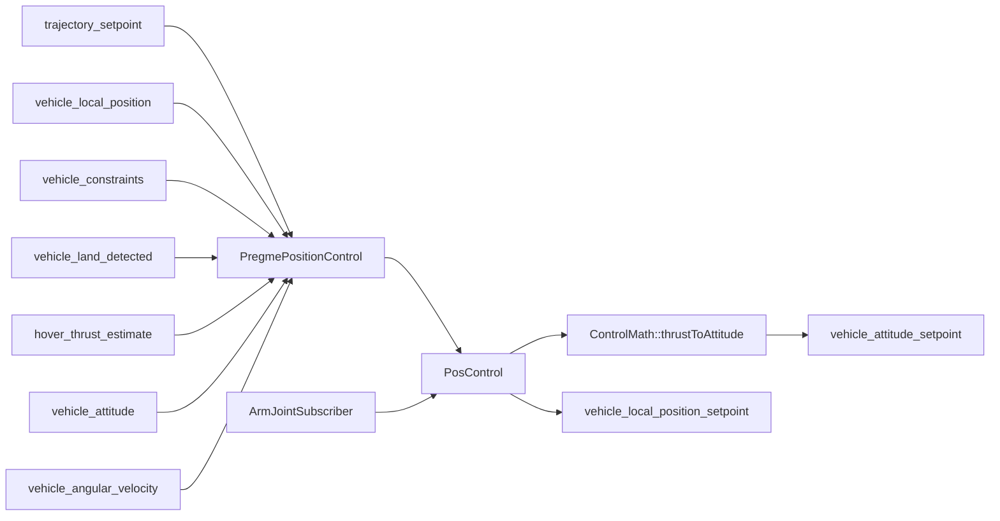

# PreGME 位置控制详解

> 本页描述 `pregme_pos_control` 的**实际源码行为**，并在必要处对照 PreGME 论文。内容覆盖位置控制律、两级 CESO、预设误差轨迹、CoM 补偿、推力转换、起降保护和失效处理

## 阅读指南

- [模块边界](#模块边界)
- [数据流与坐标约定](#数据流与坐标约定)
- [位置控制律](#位置控制律)
- [预设误差轨迹](#预设误差轨迹)
- [位置 CESO](#位置-ceso)
- [CoM 向心补偿](#com-向心补偿)
- [加速度到推力与姿态](#加速度到推力与姿态)
- [起飞、着陆与失效保护](#起飞着陆与失效保护)
- [uORB 接口](#uorb-接口)
- [参数整定顺序](#参数整定顺序)
- [诊断建议](#诊断建议)
- [论文与实现差异](#论文与实现差异)

---

## 模块边界

位置控制由两个层次组成：

| 层次 | 类 | 职责 |
| :--- | :--- | :--- |
| PX4 模块层 | `PregmePositionControl` | 读取 uORB、处理估计器复位、起飞状态机、约束、悬停推力、失效保护和发布设定值 |
| 算法层 | `PosControl` | 计算预设轨迹、位置/速度误差、CESO、CoM 补偿、控制加速度与推力矢量 |
| 数学工具 | `ControlMath` | 将推力方向和偏航角转换为姿态四元数，并限制最大倾角 |

> `PregmePositionControl` 不是纯控制律封装。起飞、落地和状态有效性逻辑会直接改变输入设定值、推力下限和控制器复位状态。

---

## 数据流与坐标约定



PX4 本地位置采用 NED 约定：

- $x$：北；
- $y$：东；
- $z$：向下；
- 上升速度为负；
- `thrust_body[2]` 在正常飞行时为负。

---

## 输入状态与设定值

### 状态转换

`set_vehicle_states()` 从 `vehicle_local_position` 构造：

$$
p,\qquad v,\qquad \dot{v},\qquad \psi.
$$

其中加速度不是直接读取，而是由速度数值微分并经过一阶低通获得：

$$
\dot{v}_{\mathrm{f},k}
=
\alpha\dot{v}_{\mathrm{f},k-1}
+
(1-\alpha)\frac{v_k-v_{k-1}}{\Delta t},
\qquad
\alpha=e^{-2\pi f_c\Delta t}.
$$

截止频率由 `PREGME_VELD_LP` 设置。

### 设定值兼容

控制器接收位置、速度和加速度设定值。若某轴位置设定值为 NaN，但速度设定值有效，源码会临时构造

$$
p_d \leftarrow p+v_d\Delta t.
$$

因此，速度控制可以复用同一套位置误差结构。

---

## 位置控制律

### 论文形式

紧凑动力学为

$$
\dot{p}=v,\qquad
\dot{v}=u_v+\Delta_v.
$$

定义位置误差

$$
\tilde{p}=p-p_d,
\qquad
z_p=\tilde{p}-\beta_p,
$$

滑模变量为

$$
s_p=\dot{z}_p+\Lambda_p z_p.
$$

论文中的控制力矢量可写为

$$
\mathbf T
=
(m_B+m_R)
\left(
gn+\hat{\Delta}_v-\ddot{p}_d-\ddot{\beta}_p
+\Lambda_p\dot{z}_p+K_p s_p
\right).
$$

### 源码形式

源码使用

$$
z_p=\tilde{p}-k\beta_p,
\qquad
\dot{z}_p=\tilde{v}-k\dot{\beta}_p,
$$

并计算

$$
s_p=\dot{z}_p+\Lambda_p z_p.
$$

`PosControl::_positionControl()` 中的中间量 `f_iusl` 为

$$
f_{\mathrm{iusl}}
=
K_p s_p+g+\Delta_v+\Lambda_p\dot{z}_p-k\ddot{\beta}_p.
$$

随后定义期望加速度

$$
a_{\mathrm{cal}}
=
-f_{\mathrm{iusl}}+g.
$$

结合源码符号，可整理为

$$
a_{\mathrm{cal}}
=
-\left(
K_p s_p+\Delta_v+\Lambda_p\dot{z}_p-k\ddot{\beta}_p
\right).
$$

这里的 $\Delta_v$ 已包含 ESO 残差估计、CoM 补偿以及注入保护。

### 参数作用

| 参数组 | 作用 |
| :--- | :--- |
| `PREGME_LPX/Y/Z` | $\Lambda_p$ 对角元素，控制误差面收敛速度 |
| `PREGME_KPX/Y/Z` | $K_p$ 对角元素，控制滑模变量反馈强度 |
| `PREGME_PSK` | $k$，决定预设轨迹补偿参与程度 |

增大 $\Lambda_p$ 或 $K_p$ 通常会减小跟踪误差，但也会增加倾角、推力和姿态环带宽需求。

---

## 预设误差轨迹

### 刷新条件

每个轴独立检测位置设定值变化：

$$
\left|p_{d,\mathrm{last}}-p_d\right|
\ge \varepsilon_{\mathrm{reset}}.
$$

满足条件时：

- 该轴时间重置为零；
- 保存当前初始位置误差和速度误差；
- 重新生成 $\beta_p,\dot{\beta}_p,\ddot{\beta}_p$。

### 初值缩放

源码并未直接使用当前误差，而是先乘以 `PREGME_PSW`：

$$
e_0=w\tilde{p}(0),\qquad
\dot{e}_0=w\tilde{v}(0).
$$

随后计算

$$
b=le_0+\dot{e}_0,
\qquad
c=\frac{|b|}{2}+\varepsilon_{\mathrm{reset}}.
$$

最终：

$$
\begin{aligned}
\beta_p(t)
&=
e_0e^{-lt}
+
\frac{b}{c}\left(1-e^{-ct}\right)e^{-lt},\\
\dot{\beta}_p(t)
&=
-l\beta_p(t)+be^{-(l+c)t},\\
\ddot{\beta}_p(t)
&=
-l\dot{\beta}_p(t)-b(l+c)e^{-(l+c)t}.
\end{aligned}
$$

### 参数解释

| 参数 | 增大后的典型影响 |
| :--- | :--- |
| `PREGME_PSL` | 轨迹衰减更快，瞬态更激进 |
| `PREGME_PSW` | 初始误差轨迹幅值更大 |
| `PREGME_PSEPS` | 需要更大的设定值变化才刷新轨迹，同时提高内部 $c$ |
| `PREGME_PSK` | 增强预设轨迹对控制律的影响 |

> **配置冲突**
>
> 上传的中文参数 YAML 中 `PREGME_PSK` 默认值为 `0`，英文 YAML 中为 `1`。`0` 会关闭大部分预设轨迹补偿，应在构建前统一。

---

## 位置 CESO

### 论文中的单层 ESO

论文利用可测速度构造

$$
\dot{h}_v=\frac{\alpha_v g(v-h_v)}{\varepsilon_v}+u_v,
\qquad
\hat{\Delta}_v=\frac{\alpha_v g(v-h_v)}{\varepsilon_v}.
$$

### 源码中的两级观察器

当前实现从位置量开始：

第一级：

$$
\begin{aligned}
e_1 &= p-\xi_1,\\
\dot{\xi}_1 &= \frac{g(e_1,L_1)}{\varepsilon},\\
\hat{v} &= \dot{\xi}_1.
\end{aligned}
$$

第二级：

$$
\begin{aligned}
e_2 &= \hat{v}-\xi_2,\\
\dot{\xi}_2 &= \frac{g(e_2,L_2)}{\varepsilon}+u_v,\\
\hat{\Delta}_v &= \frac{g(e_2,L_2)}{\varepsilon}.
\end{aligned}
$$

非线性函数为

$$
g(e,L)
=
L e
\frac{e^e+e^{-e}}
{c_1\left(e^e+e^{-e}\right)+c_2}.
$$

为防止数值溢出，误差被限制到 $[-20,20]$，且 $\varepsilon$ 的绝对值不得小于 $10^{-4}$。

### 观测器输入

源码先计算

$$
u_v=-f_{\mathrm{iusl}}+g+\Delta_{v,\mathrm{com}},
$$

再更新 CESO。已知的 CoM 补偿被并入观测器输入，使 CESO 主要估计剩余未知扰动。

### 注入保护

原始扰动

$$
\Delta_{v,\mathrm{raw}}
=
\hat{\Delta}_{v,\mathrm{ESO}}+\Delta_{v,\mathrm{com}}
$$

不会直接进入控制律，而是逐轴经过：

| 保护 | XY | Z |
| :--- | :---: | :---: |
| 限幅 | $\pm1.5\ \mathrm{m/s^2}$ | $\pm2.0\ \mathrm{m/s^2}$ |
| 低通截止频率 | 1.5 Hz | 1.5 Hz |
| 软死区 | $0.03\ \mathrm{m/s^2}$ | $0.03\ \mathrm{m/s^2}$ |

无对应控制设定值时，该轴注入被复位为零。

---

## CoM 向心补偿

位置环从 `ArmJointSubscriber` 获取系统总质心 $p_C^B$，并使用当前机体角速度计算

$$
a_c^B
=
\omega\times\left(\omega\times p_C^B\right).
$$

转换到世界系后：

$$
\Delta_{v,\mathrm{com}}
=
-Ra_c^B.
$$

补偿由 `PREGME_COMCP_EN` 控制。

### 能补偿与不能补偿的内容

| 能显式补偿 | 仍交给 ESO |
| :--- | :--- |
| 当前角速度和 CoM 偏移导致的向心项 | 关节角加速度项 |
| 已知姿态下的坐标变换 | 时变惯性与未建模柔性 |
| 在线计算得到的静态/准静态 CoM 偏移 | 气动扰动、模型误差和通信延迟 |

---

## 加速度到推力与姿态

### 倾角方向

源码根据水平期望加速度构造机体 $z$ 轴：

$$
b_{3,d}
=
\operatorname{normalize}
\begin{bmatrix}
-a_x\\
-a_y\\
g
\end{bmatrix}.
$$

随后 `ControlMath::limitTilt()` 将 $b_{3,d}$ 与世界系向下轴之间的夹角限制到 `_lim_tilt`。

### 归一化总推力

垂向加速度通过悬停推力缩放：

$$
T_c
=
\frac{a_z}{g}T_{\mathrm{hover}}-T_{\mathrm{hover}}.
$$

倾斜时再除以 $e_3^Tb_{3,d}$ 进行补偿，并构造

$$
\mathbf t_{\mathrm{sp}}=T_c b_{3,d}.
$$

### 推力限幅

源码依次执行：

- 最小推力限制；
- 垂直分量最大推力限制；
- 根据剩余推力球面约束水平分量；
- 起降阶段额外限制 `thrust_body[2]` 的变化率。

### 姿态转换

`ControlMath::thrustToAttitude()` 使用

- 推力矢量确定期望机体 $z$ 轴；
- 期望偏航确定水平参考方向；
- 正交叉乘构造 $R_d$；
- 将 $R_d$ 转为四元数并写入 `vehicle_attitude_setpoint.q_d`。

---

## 起飞、着陆与失效保护

### 起飞状态机

`Takeoff` 状态按以下顺序演化：

```text
disarmed → spoolup → ready → rampup → flight
```

起飞前或地面接触时：

- 推力下限允许为零；
- ESO 与预设轨迹被复位；
- 使用固定 `PREGME_THRHOV`，不启用悬停推力估计；
- 倾角使用 `PREGME_TILTLND`；
- 起飞速度通过斜坡逐步增加。

进入飞行状态后：

- 最小推力切换到 `PREGME_THRMIN`；
- 可根据 `hover_thrust_estimate` 更新悬停推力；
- 倾角逐步切换到 `PREGME_TILTAIR`。

### 落地与自动解锁

检测到真实飞行后的稳定触地，且垂向速度低于约 $0.35\ \mathrm{m/s}$，持续约 1.2 s 后，模块会发送非强制解除武装命令；请求间隔至少 2 s。

### 推力压摆率

| 阶段 | 代码中的变化率 |
| :--- | :---: |
| 起飞 | 0.60 /s |
| 正常飞行 | 10.0 /s |
| 地面无起飞请求 | 目标推力归零 |

### 无效设定值

若 `PosControl::update()` 失败：

- 先经过 200 ms 滞回；
- 水平速度有效时保持水平停止；
- 水平状态无效时采用盲降；
- 垂向速度无效时使用小的向下加速度；
- 清除 `want_takeoff` 并重新运行控制器。

---

## uORB 接口

### 订阅

| Topic | 用途 |
| :--- | :--- |
| `vehicle_local_position` | 位置、速度、航向及估计器复位量 |
| `trajectory_setpoint` | 位置/速度/加速度/yaw 设定值 |
| `vehicle_constraints` | 起飞请求及垂向速度约束 |
| `vehicle_control_mode` | 位置控制使能和解锁状态 |
| `vehicle_land_detected` | 落地与地面接触状态 |
| `hover_thrust_estimate` | 飞行后的悬停推力更新 |
| `vehicle_attitude` | CoM 补偿坐标变换 |
| `vehicle_angular_velocity` | CoM 向心补偿 |

### 发布

| Topic | 内容 |
| :--- | :--- |
| `vehicle_attitude_setpoint` | 期望四元数、总推力和偏航角速度 |
| `vehicle_local_position_setpoint` | 控制器内部设定值和推力，便于日志分析 |
| `takeoff_status` | 起飞状态与当前倾角限制 |

---

## 参数整定顺序

### 基础平台参数

先确认：

- `PREGME_THRHOV` 能在无机械臂运动时稳定悬停；
- `PREGME_THRMAX` 有足够裕量；
- `PREGME_TILTAIR` 不超过平台可承受倾角；
- 位置、速度和姿态坐标方向一致。

### 关闭复杂补偿建立基线

建议初始阶段：

```text
PREGME_PSK      = 0
PREGME_COMCP_EN = false
```

并先用较小的 $\Lambda_p$、$K_p$ 获得稳定位置控制。

### 调整反馈增益

1. 增大 `LPX/LPY`，直到水平误差收敛速度合适。
2. 增大 `KPX/KPY`，提高抗扰和制动能力。
3. 单独调整 `LPZ/KPZ`，避免垂向推力泵动。
4. 若频繁触发倾角或推力限制，应先降低增益，而不是继续提高姿态环增益。

### 启用 CESO

1. 先保持较大的 `EVEPS`。
2. 从小值增加 `EV1*`，观察速度估计。
3. 再增加 `EV2*`，观察扰动估计和位置误差。
4. 逐步减小 `EVEPS` 以提高响应。
5. 出现高频推力或倾角抖动时，提高 `EVC2`、降低 `EV2*` 或增大 `EVEPS`。

### 启用预设轨迹

将 `PREGME_PSK` 从 0 逐步增加到 1，并根据任务调整：

- `PSL`：目标收敛时间；
- `PSW`：轨迹初始幅度；
- `PSEPS`：设定值刷新灵敏度。

### 启用 CoM 补偿

最后打开 `PREGME_COMCP_EN`，确认关节角和 CoM 数据有效。若机械臂静止时仍出现明显偏置，先检查 CoM 坐标方向和质量参数。

---

## 诊断建议

| 现象 | 优先检查 |
| :--- | :--- |
| 水平位置慢但平稳 | 增大 `LPX/Y`，再增大 `KPX/Y` |
| 水平振荡或姿态频繁饱和 | 降低 `KPX/Y`、`LPX/Y`，检查倾角限制 |
| 高度上下泵动 | 降低 `EV2Z` 或 `KPZ`，增大 `EVEPS`，检查悬停推力 |
| 机械臂运动时低频偏差 | 检查 `COMCP_EN`、系统 CoM 与总质量 |
| 机械臂快速运动时尖峰 | 检查 CESO 注入限幅，降低观测器带宽 |
| 起飞瞬间推力跳变 | 检查 `THRHOV`、`TKORAMP`、`TKOSPD` 和落地状态 |
| 位置设定值变化后轨迹不生效 | 检查 `PSK` 是否为 0、设定值变化是否超过 `PSEPS` |
| 控制器报告 invalid setpoints | 检查位置/速度成对有效性和加速度状态 |

日志中建议同时记录：

- `vehicle_local_position_setpoint.thrust`；
- 位置误差与速度误差；
- `_pregme_eso.delta_est`；
- `_delta_v_comp`；
- 起飞状态和倾角限制。

---

## 论文与实现差异

| 项目 | 论文 | 当前源码 |
| :--- | :--- | :--- |
| ESO 输入状态 | 直接使用速度 | 从位置构造两级观察器 |
| 预设轨迹初值 | $\beta(0)=\tilde{p}(0)$ | 先乘 `PREGME_PSW` |
| $c_i$ 选择 | 满足性能包络不等式 | 使用 $|b|/2+\varepsilon$ 的启发式公式 |
| 性能包络 $\rho$ | 显式设计并用于理论证明 | 未在运行时显式计算 |
| 扰动注入 | 估计值直接反馈 | 增加固定限幅、低通和死区 |
| CoM 耦合 | 可作为耦合扰动处理 | 显式补偿向心项，CESO 估计残差 |
| 推力输入 | 物理力矢量 | 通过悬停推力映射为归一化 PX4 推力 |

## 相关页面

- [PreGME 控制器概述](index.md)
- [姿态控制详解](attitude-control.md)
- [参数参考与整定指南](parameters.md)
